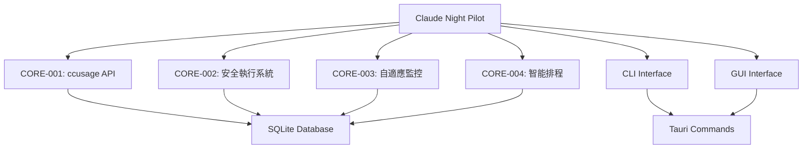

# Claude Night Pilot - 專案規則與開發指南

**版本**: v1.0.0  
**更新時間**: 2025-07-24T02:00:00+08:00  
**適用範圍**: 所有貢獻者和維護者

## 📋 目錄

- [專案概覽](#專案概覽)
- [架構原則](#架構原則)
- [開發規範](#開發規範)
- [編碼標準](#編碼標準)
- [測試要求](#測試要求)
- [安全性規則](#安全性規則)
- [文檔規範](#文檔規範)
- [發布流程](#發布流程)

## 🎯 專案概覽

### 專案使命
Claude Night Pilot 致力於成為最完整、最安全、最易用的 Claude CLI 自動化管理工具，整合四大開源專案的優勢，提供零雲端依賴的本地解決方案。

### 核心原則
1. **安全第一** - 多層安全檢查，完整審計日誌
2. **用戶體驗** - 零學習曲線，直觀操作
3. **性能優化** - 低資源消耗，快速響應
4. **可維護性** - 清晰架構，模組化設計
5. **開源友善** - MIT 授權，歡迎貢獻

## 🏗️ 架構原則

### 四核心模組架構



### 設計模式

#### 1. 模組化設計
- **單一職責原則**: 每個模組專注一個核心功能
- **介面隔離**: 清晰的API邊界和契約
- **依賴反轉**: 依賴抽象而非具體實現

#### 2. 事件驅動架構
- **Tokio Channels**: 異步事件傳遞
- **Broadcast Events**: 多訂閱者事件分發
- **Error Propagation**: 統一錯誤處理機制

#### 3. 數據持久化
- **SQLx**: 編譯時查詢驗證
- **Migration**: 版本化資料庫結構
- **ACID**: 確保數據一致性

## 📝 開發規範

### 技術棧標準

#### Rust 後端 (>= 1.76)
```toml
[dependencies]
tauri = "2.7.0"
sqlx = "0.8.6"
tokio = "1.0"
chrono = "0.4"
chrono-tz = "0.9"
anyhow = "1.0"
serde = "1.0"
clap = "4.0"
```

#### 前端 (Node.js >= 18)
```json
{
  "@tauri-apps/cli": "^2.7.1",
  "htmx": "^1.9.0",
  "playwright": "^1.54.1"
}
```

### 文件結構規範

```
src-tauri/src/
├── lib.rs              # 主程式邏輯，Tauri 設定
├── db.rs               # 資料庫層，CRUD 操作
├── executor.rs         # 安全執行系統 (CORE-002)
├── usage_tracker.rs    # ccusage API 整合 (CORE-001)
├── adaptive_monitor.rs # 自適應監控 (CORE-003)
├── smart_scheduler.rs  # 智能排程 (CORE-004)
└── bin/
    └── cnp.rs         # CLI 工具主程式
```

### Git 工作流程

#### 分支策略
- **main**: 穩定版本，僅接受 release 合併
- **develop**: 開發主分支，集成所有功能
- **feature/***: 功能開發分支
- **bugfix/***: 錯誤修復分支
- **hotfix/***: 緊急修復分支

#### 提交訊息格式
```
<type>(<scope>): <description>

[optional body]

[optional footer]
```

**Type 類型**:
- `feat`: 新功能
- `fix`: 錯誤修復
- `docs`: 文檔更新
- `style`: 代碼格式調整
- `refactor`: 代碼重構
- `test`: 測試相關
- `chore`: 建置工具或輔助工具變動

**範例**:
```
feat(core-001): 添加 ccusage 多指令回退機制

- 實現 ccusage → npx ccusage → bunx ccusage 回退
- 添加智能文本解析功能
- 整合 30 秒快取機制

Closes #123
```

## 💻 編碼標準

### Rust 編碼規範

#### 1. 命名規範
```rust
// 模組和文件名: snake_case
mod usage_tracker;

// 結構體和枚舉: PascalCase
pub struct UsageTracker;
pub enum MonitoringMode;

// 函數和變數: snake_case
pub async fn get_usage_info() -> Result<UsageInfo>;
let current_time = Utc::now();

// 常數: SCREAMING_SNAKE_CASE
const DEFAULT_TIMEOUT: u64 = 300;
```

#### 2. 錯誤處理
```rust
// 使用 anyhow::Result 統一錯誤處理
use anyhow::{Result, bail, Context};

pub async fn example_function() -> Result<String> {
    let result = risky_operation()
        .await
        .context("執行風險操作失敗")?;
    
    if !result.is_valid() {
        bail!("結果驗證失敗: {}", result.error);
    }
    
    Ok(result.data)
}
```

#### 3. 文檔註解
```rust
/// ccusage API 整合模組
/// 
/// 提供多指令回退機制和智能解析功能，支援:
/// - ccusage → npx ccusage → bunx ccusage 回退
/// - JSON 和多種文本格式解析
/// - 30 秒智能快取機制
/// 
/// # Examples
/// 
/// ```rust
/// let mut tracker = UsageTracker::new(db).await?;
/// let usage = tracker.get_usage_info().await?;
/// println!("剩餘分鐘: {}", usage.remaining_minutes);
/// ```
pub struct UsageTracker {
    // 實現細節...
}
```

#### 4. 測試規範
```rust
#[cfg(test)]
mod tests {
    use super::*;
    
    #[tokio::test]
    async fn test_usage_tracker_basic_functionality() {
        // Arrange
        let db = Database::new_mock();
        let mut tracker = UsageTracker::new(db).await.unwrap();
        
        // Act
        let usage = tracker.get_usage_info().await.unwrap();
        
        // Assert
        assert!(usage.remaining_minutes > 0);
        assert!(!usage.source.is_empty());
    }
    
    #[test]
    fn test_efficiency_score_calculation() {
        // 測試理想使用率 (80%)
        assert_eq!(calculate_efficiency_score(100, 80), 1.0);
        
        // 測試緊湊使用率 (100%)
        assert_eq!(calculate_efficiency_score(100, 100), 0.8);
        
        // 測試超出容量 (120%)
        assert_eq!(calculate_efficiency_score(100, 120), 0.0);
    }
}
```

### JavaScript/Frontend 編碼規範

#### 1. ESLint 配置
```json
{
  "extends": ["eslint:recommended"],
  "env": {
    "browser": true,
    "es2022": true
  },
  "rules": {
    "no-console": "warn",
    "no-unused-vars": "error",
    "prefer-const": "error",
    "no-var": "error"
  }
}
```

#### 2. 命名和結構
```javascript
// 使用 camelCase
const currentUser = getCurrentUser();
const apiResponse = await fetchData();

// 使用 PascalCase for constructors
class TaskManager {
    constructor(options) {
        this.options = options;
    }
}

// 使用 UPPER_SNAKE_CASE for constants
const API_ENDPOINT = '/api/v1/tasks';
const MAX_RETRY_COUNT = 3;
```

## 🧪 測試要求

### 測試覆蓋率標準

| 類型 | 最低覆蓋率 | 目標覆蓋率 | 強制性 |
|------|-----------|-----------|--------|
| 單元測試 | 70% | 85% | ✅ |
| 整合測試 | 60% | 80% | ✅ |
| E2E 測試 | 主要流程 | 所有功能 | ✅ |
| CLI 測試 | 所有命令 | 所有參數組合 | ✅ |

### 測試分類

#### 1. Rust 單元測試
```rust
// src-tauri/src/usage_tracker.rs
#[cfg(test)]
mod tests {
    use super::*;
    
    #[tokio::test]
    async fn test_ccusage_command_fallback() {
        // 測試多指令回退機制
    }
    
    #[test]
    fn test_parse_usage_formats() {
        // 測試各種文本格式解析
    }
}
```

#### 2. CLI 功能測試
```bash
# tests/cli/basic.bats
#!/usr/bin/env bats

@test "cnp --help shows usage information" {
    run cargo run --bin cnp -- --help
    [ "$status" -eq 0 ]
    [[ "$output" =~ "Claude Night Pilot - CLI 工具" ]]
}

@test "cnp status shows system status" {
    run cargo run --bin cnp -- status
    [ "$status" -eq 0 ]
    [[ "$output" =~ "資料庫連接正常" ]]
}
```

#### 3. Playwright E2E 測試
```javascript
// tests/e2e/gui.spec.js
const { test, expect } = require('@playwright/test');

test('GUI basic functionality', async ({ page }) => {
    await page.goto('http://localhost:1420');
    
    // 測試應用啟動
    await expect(page.locator('h1')).toContainText('Claude Night Pilot');
    
    // 測試 Prompt 建立
    await page.click('[data-testid="create-prompt"]');
    await page.fill('[data-testid="prompt-title"]', '測試 Prompt');
    await page.click('[data-testid="save-prompt"]');
    
    await expect(page.locator('[data-testid="prompt-list"]')).toContainText('測試 Prompt');
});
```

### 測試執行流程

#### 開發階段
```bash
# 每次提交前執行
cargo test                    # Rust 單元測試
npm run lint                  # ESLint 檢查
npm run test:unit            # JavaScript 單元測試
```

#### CI/CD 流程
```bash
# 完整測試套件
cargo test --all-features    # 所有 Rust 測試
npm run test                 # 所有前端測試
npm run test:e2e            # E2E 測試
cargo clippy -- -D warnings # Rust linting
```

## 🔒 安全性規則

### 安全開發原則

#### 1. 輸入驗證
```rust
// 所有外部輸入必須驗證
pub fn validate_prompt(prompt: &str) -> Result<()> {
    if prompt.is_empty() {
        bail!("Prompt 不能為空");
    }
    
    if prompt.len() > MAX_PROMPT_LENGTH {
        bail!("Prompt 長度超過限制: {}", MAX_PROMPT_LENGTH);
    }
    
    // 檢查危險模式
    if contains_dangerous_patterns(prompt) && !skip_permissions {
        bail!("檢測到危險模式，請使用 --dangerously-skip-permissions");
    }
    
    Ok(())
}
```

#### 2. 權限檢查
```rust
// 多層安全檢查
pub async fn perform_security_check(
    prompt: &str, 
    options: &ExecutionOptions
) -> Result<SecurityCheckResult> {
    let mut result = SecurityCheckResult::new();
    
    // 1. 環境授權檢查
    if !is_authorized_environment() {
        result.add_error("未授權的執行環境");
    }
    
    // 2. 工作目錄驗證
    if let Some(dir) = &options.working_directory {
        if !is_safe_working_directory(dir) {
            result.add_error("不安全的工作目錄");
        }
    }
    
    // 3. 危險模式檢測
    let risk_level = assess_risk_level(prompt);
    if risk_level == RiskLevel::Critical && !options.skip_permissions {
        result.add_error("高風險操作需要明確授權");
    }
    
    result.passed = result.errors.is_empty();
    Ok(result)
}
```

#### 3. 審計日誌
```rust
// 完整的執行審計記錄
pub struct ExecutionAudit {
    pub id: Option<i64>,
    pub timestamp: DateTime<Utc>,
    pub prompt_hash: String,          // SHA256 哈希
    pub options: ExecutionOptions,
    pub security_check: SecurityCheckResult,
    pub execution_start: Option<DateTime<Utc>>,
    pub execution_end: Option<DateTime<Utc>>,
    pub result: ExecutionResult,
    pub output_length: Option<usize>,
    pub error_message: Option<String>,
}
```

### 敏感資料處理

#### 1. 資料加密
- **密碼**: 使用 bcrypt 或 Argon2 雜湊
- **API 金鑰**: 系統 keychain 存儲
- **日誌**: 敏感資料遮罩或移除

#### 2. 權限最小化
- **檔案存取**: 僅限必要目錄
- **網路存取**: 明確的端點白名單
- **系統呼叫**: 最小權限原則

## 📚 文檔規範

### 文檔結構

#### 1. README.md
- 專案簡介和核心特色
- 快速開始指南
- 完整功能說明
- 效能指標和測試結果

#### 2. API 文檔
```rust
/// 取得當前使用量資訊
///
/// # Arguments
///
/// * `force_refresh` - 強制重新整理快取
///
/// # Returns
///
/// 回傳 `UsageInfo` 結構包含:
/// - `remaining_minutes`: 剩餘分鐘數
/// - `total_minutes`: 總分鐘數  
/// - `usage_percentage`: 使用百分比
/// - `source`: 資料來源
///
/// # Errors
///
/// 當以下情況發生時回傳錯誤:
/// - ccusage 命令不可用
/// - 解析回應失敗
/// - 資料庫存取錯誤
///
/// # Examples
///
/// ```rust
/// let mut tracker = UsageTracker::new(db).await?;
/// let usage = tracker.get_usage_info().await?;
/// println!("剩餘: {} 分鐘", usage.remaining_minutes);
/// ```
pub async fn get_usage_info(&mut self) -> Result<UsageInfo>
```

#### 3. 架構決策記錄 (ADR)
```markdown
# ADR-001: 選擇 Tauri 作為桌面應用框架

## 狀態
已接受

## 情境
需要建立跨平台桌面應用，同時支援 Web 技術和 Rust 後端。

## 決策
選擇 Tauri 2.7.0 作為主要框架。

## 後果
### 正面影響
- 較小的應用程式大小 (~8MB vs ~150MB Electron)
- 原生效能和安全性
- Rust 生態系統整合

### 負面影響
- 較小的社群和生態系統
- 學習曲線較陡峭
- 某些 Web API 限制

## 替代方案
- Electron: 較大檔案但生態系統成熟
- Wails: Go 後端但功能較少
- 純 Web 應用: 缺乏系統整合
```

### 變更日誌

#### CHANGELOG.md 格式
```markdown
# Changelog

所有重要變更都會記錄在此檔案中。

格式基於 [Keep a Changelog](https://keepachangelog.com/zh-TW/1.0.0/)，
版本控制遵循 [Semantic Versioning](https://semver.org/lang/zh-TW/)。

## [1.0.0] - 2025-07-24

### Added
- CORE-001: ccusage API 整合模組
- CORE-002: 安全執行系統
- CORE-003: 自適應監控系統  
- CORE-004: 智能排程系統
- CLI 工具完整實現
- Tauri 桌面應用程式
- SQLite 資料庫整合
- 完整測試套件

### Changed
- 無

### Deprecated
- 無

### Removed
- 無

### Fixed
- 無

### Security
- 多層安全檢查機制
- 完整審計日誌記錄
```

## 🚀 發布流程

### 版本號規則 (Semantic Versioning)

```
MAJOR.MINOR.PATCH[-PRERELEASE][+BUILD]

範例:
- 1.0.0        (正式版本)
- 1.1.0-beta.1 (預覽版本)  
- 1.1.0+20250724 (包含建置資訊)
```

#### 版本遞增規則
- **MAJOR**: 破壞性變更 (API 不相容)
- **MINOR**: 新功能 (向後相容)
- **PATCH**: 錯誤修復 (向後相容)

### 發布檢查清單

#### Pre-release 檢查
- [ ] 所有測試通過 (`cargo test && npm test`)
- [ ] 程式碼品質檢查通過 (`cargo clippy && npm run lint`)
- [ ] 文檔已更新
- [ ] CHANGELOG.md 已更新
- [ ] 版本號已更新
- [ ] 安全掃描通過

#### Release 流程
1. **建立 Release Branch**
   ```bash
   git checkout -b release/v1.0.0
   git push origin release/v1.0.0
   ```

2. **執行完整測試**
   ```bash
   cargo test --all-features
   npm run test:full
   npm run test:e2e
   ```

3. **建置發布版本**
   ```bash
   npm run build:release
   cargo build --release
   ```

4. **建立 Git Tag**
   ```bash
   git tag -a v1.0.0 -m "Release version 1.0.0"
   git push origin v1.0.0
   ```

5. **GitHub Release**
   - 建立 GitHub Release
   - 上傳建置檔案
   - 撰寫 Release Notes

### 發布後檢查
- [ ] 下載並測試發布檔案
- [ ] 確認文檔網站更新
- [ ] 監控使用者回饋
- [ ] 記錄發布指標

## 📞 聯繫與支援

### 開發團隊
- **架構負責人**: 核心模組設計與實現
- **測試負責人**: 測試策略與品質保證
- **文檔負責人**: 技術文檔與使用指南
- **社群管理**: 問題回應與功能建議

### 獲得幫助
1. **GitHub Issues**: 錯誤回報與功能請求
2. **GitHub Discussions**: 使用問題與技術討論
3. **Documentation**: 詳細技術文檔
4. **Code Review**: Pull Request 審核與建議

---

## 📄 附錄

### A. 常用命令參考

#### 開發環境設定
```bash
# 環境準備
rustup update
npm install

# 資料庫初始化
cargo run --bin cnp -- init

# 開發伺服器
npm run tauri dev
```

#### 測試命令
```bash
# Rust 測試
cargo test
cargo test --package claude-night-pilot --lib usage_tracker

# 前端測試
npm test
npm run test:e2e

# 程式碼品質
cargo clippy
npm run lint
```

#### 建置命令
```bash
# 開發建置
npm run build

# 生產建置  
npm run build:release
cargo build --release

# CLI 工具安裝
npm run cli:install
```

### B. 故障排除

#### 常見問題
1. **編譯錯誤**: 檢查 Rust 版本和依賴
2. **資料庫錯誤**: 執行 `sqlx migrate run`
3. **權限錯誤**: 使用 `--dangerously-skip-permissions`
4. **測試失敗**: 檢查環境變數和資料庫狀態

#### 效能調優
1. **編譯時間**: 使用 `cargo check` 進行快速檢查
2. **測試速度**: 使用 `cargo test --release` 優化測試
3. **應用啟動**: 檢查資料庫連接和初始化

---

**Claude Night Pilot Project Rules v1.0.0**  
*讓代碼更安全、更可靠、更易維護* 🌙✨ 