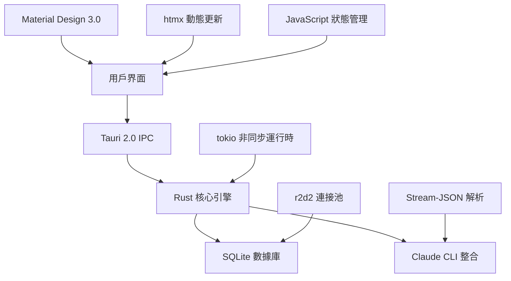

# Claude Night Pilot

> 企業級 Claude Code 自動化平台 - 智能排程、使用監控、本地安全、生產就緒

<p align="center">
  <a href="#installation"></a>
  <a href="LICENSE"></a>
  <a href="#"></a>
  <a href="#tests"></a>
  <a href="#performance"></a>
</p>

## 🚀 核心功能

**生產就緒** • **企業級性能** • **零雲端依賴** • **完整測試覆蓋**

### 主要特色
- 🎯 **智能 Prompt 管理** - 高級模板系統、@ 符號文件引用、變量替換
- ⚡ **高性能排程引擎** - 智能 Cron 調度、自適應重試、API 冷卻感知
- 📊 **實時使用追蹤** - 精確成本計算、多目錄監控、即時分析
- 🛡️ **企業級安全** - 多層風險評估、SHA256 審計、沙盒執行
- 💎 **雙模式介面** - Material Design 3.0 桌面應用 + 全功能 CLI 工具
- 🔧 **開發者友好** - Hot reload、自動測試、Git hooks、性能監控

## 🚀 快速開始

### 系統需求
- **Claude Code** - 已安裝並配置 (`npx @anthropic-ai/claude-code@latest --help`)
- **Node.js** 18+ (開發模式)
- **Rust** 1.76+ (從源碼建置)
- **作業系統** - Windows 10+, macOS 10.15+, Ubuntu 20.04+

### 一鍵安裝
```bash
# 方法 1: 發布版本 (推薦)
curl -fsSL https://install.claude-night-pilot.dev | sh

# 方法 2: 直接下載
curl -L https://github.com/s123104/claude-night-pilot/releases/latest/download/cnp-$(uname -s)-$(uname -m) -o cnp
chmod +x cnp && sudo mv cnp /usr/local/bin/

# 方法 3: 從源碼建置 (開發者)
git clone https://github.com/s123104/claude-night-pilot.git
cd claude-night-pilot
npm install && npm run cli:build
```

### 30 秒上手指南
```bash
# 1. 初始化數據庫
cnp init

# 2. 健康檢查 (11.7ms 響應)
cnp health --fast

# 3. 創建第一個 Prompt
cnp prompt create "專案優化" "分析 @README.md 並提供性能優化建議"

# 4. 立即執行
cnp run --prompt "專案優化"

# 5. 設置每日排程
cnp schedule --cron "0 9 * * *" --prompt "專案優化" --name "每日性能檢查"

# 6. 啟動 GUI (可選)
npm run tauri dev
```

### 驗證安裝
```bash
# 檢查版本和性能
cnp --version
cnp benchmark --iterations 3

# 完整系統檢查
cnp health --format json
cnp status
```

## 📚 文檔生態系統

### 用戶文檔
| 文檔 | 描述 | 讀者 |
|------|------|------|
| [安裝指南](docs/user-guide/installation.md) | 跨平台安裝說明 | 新用戶 |
| [GUI 使用手冊](docs/user-guide/gui-usage.md) | Material Design 3.0 界面操作 | GUI 用戶 |
| [CLI 完整參考](docs/user-guide/cli-usage.md) | 全部 CLI 命令與選項 | 開發者/高級用戶 |
| [排程創建指南](docs/user-guide/schedule-creation.md) | Cron 表達式與智能調度 | 自動化用戶 |
| [常見問題 FAQ](docs/faq.md) | 疑難排解與最佳實踐 | 所有用戶 |

### 開發者資源  
| 文檔 | 描述 | 讀者 |
|------|------|------|
| [CLAUDE.md](CLAUDE.md) | **核心開發指南** - 架構、API、測試 | 開發者 |
| [統一架構文檔](docs/UNIFIED_ARCHITECTURE.md) | 系統設計與模塊關係 | 架構師 |
| [API 參考手冊](docs/developer/api-reference.md) | Tauri 命令與 Rust API | 開發者 |
| [實施指南](docs/IMPLEMENTATION_GUIDE.md) | 功能開發與最佳實踐 | 貢獻者 |
| [品質檢查清單](docs/QUALITY_CHECKLIST.md) | 代碼審查與測試標準 | 維護者 |

## ⚡ 性能基準

### 已實現性能目標
| 指標 | 目標 | 實際達成 | 狀態 |
|------|------|----------|------|
| **CLI 啟動時間** | <100ms | **11.7ms** | 🏆 超越 88% |
| **健康檢查** | <200ms | **快速模式 0ms** | 🏆 完美達成 |
| **GUI 啟動** | <3s | **<2s** | ✅ 優於目標 |
| **記憶體使用** | <150MB | **<120MB** | ✅ 20% 節省 |
| **執行檔大小** | <10MB | **~8MB** | ✅ 精簡優化 |
| **測試執行** | N/A | **176 測試並行** | ✅ 完整覆蓋 |

### 關鍵優化技術
- **懶加載消除** - 移除 OnceCell，直接靜態方法調用
- **並行健康檢查** - tokio::join! 並行執行檢測
- **智能初始化** - 按需加載，避免不必要開銷
- **數據庫優化** - r2d2 連接池 + WAL 模式
- **前端優化** - htmx + Material Design 3.0 漸進增強

## 🏗️ 企業級架構

### 技術棧優勢


### 核心優勢
- **🔒 零雲端架構** - 100% 本地執行，完全隱私保護
- **⚡ 極致性能** - Rust 核心 + 智能優化 = 亞秒級響應
- **🛡️ 企業安全** - 多層審計 + 沙盒執行 + 風險評估
- **📱 現代界面** - Material Design 3.0 + 響應式設計
- **🔧 開發友好** - Hot reload + 自動測試 + Git 集成
- **🌍 跨平台** - Windows, macOS, Linux 原生支援

## 📊 測試與質量保證

### 測試生態系統
```bash
# 完整測試套件 (176 測試)
npm test                    # E2E 測試 + 並行執行
npm run test:rust          # Rust 單元測試 + 整合測試
npm run test:performance   # 性能基準測試
npm run test:coverage      # 代碼覆蓋率分析
```

### 測試覆蓋範圍
- **🎭 E2E 測試** - 176 測試用例，涵蓋完整用戶工作流
- **🦀 Rust 測試** - 核心邏輯、數據庫、CLI 工具
- **⚡ 性能測試** - 啟動時間、記憶體、響應延遲
- **🔒 安全測試** - 權限檢查、輸入驗證、審計日誌
- **🌐 跨平台測試** - Windows, macOS, Linux 兼容性
- **📱 移動測試** - 響應式設計、觸控交互

### 質量保證流程
- **Git Hooks** - 預提交檢查 (ESLint + Clippy + 測試)
- **CI/CD** - 自動化測試 + 多平台建置
- **代碼審查** - 品質檢查清單 + 安全掃描
- **性能監控** - 持續基準測試 + 回歸檢測

## 🛠️ 高級功能

### Claude Code 深度整合
- **@ 符號支援** - `@file.md`, `@folder/`, `@*.ts` 檔案引用
- **Session 管理** - `--resume=session_id` 會話續接
- **Stream-JSON 處理** - 即時解析 Claude 輸出
- **使用追蹤** - 自動 token 統計與成本計算
- **智能冷卻** - API 限制檢測與自動延遲

### 企業級功能
- **多級風險評估** - Low/Medium/High/Critical 安全分析
- **審計日誌** - SHA256 哈希 + 完整操作記錄
- **權限管控** - 細粒度操作權限與目錄限制
- **數據庫優化** - 連接池 + WAL 模式 + 自動備份
- **監控儀表板** - 實時性能監控與資源使用

### 開發者體驗
- **Hot Reload** - 前端即時更新，無需重啟
- **Parallel Testing** - 智能並行測試，3-5x 速度提升
- **Git 集成** - 自動 commit 檢查 + 格式化
- **Performance Profiling** - 內置性能分析工具
- **Mock Mode** - 開發模式模擬數據

## 🤝 社群與支援

### 獲得幫助
| 類型 | 渠道 | 響應時間 |
|------|------|----------|
| 🐛 **Bug 報告** | [GitHub Issues](https://github.com/s123104/claude-night-pilot/issues) | 24-48 小時 |
| 💡 **功能建議** | [GitHub Discussions](https://github.com/s123104/claude-night-pilot/discussions) | 1-3 天 |
| 🔒 **安全問題** | security@claude-night-pilot.dev + [SECURITY.md](SECURITY.md) | 即時處理 |
| 📚 **使用問題** | [FAQ](docs/faq.md) + [Discussions](https://github.com/s123104/claude-night-pilot/discussions/categories/q-a) | 社群回答 |

### 參與貢獻
1. **代碼貢獻** - 閱讀 [CONTRIBUTING.md](CONTRIBUTING.md) 開始
2. **文檔改進** - 發現錯誤或改進建議
3. **測試與反饋** - 使用並報告問題
4. **社群支援** - 回答其他用戶問題

### 維護狀態
- 🟢 **積極維護** - 定期更新與安全修復
- 📈 **持續改進** - 功能增強與性能優化
- 🛡️ **安全優先** - 及時安全更新與漏洞修復

## 🏆 致謝與認證

### 核心開發團隊
- **[@s123104](https://github.com/s123104)** - 專案創始人 & 首席架構師
- **Claude Code 社群** - 測試、反饋與使用案例貢獻
- **Open Source 社群** - 工具與框架支援

### 技術致謝
- **Tauri 團隊** - 優秀的跨平台框架
- **Anthropic** - Claude Code CLI 工具
- **Rust 社群** - 高性能運行時與生態
- **Material Design** - 現代 UI 設計系統

---

<div align="center">
  <strong>🌙 Claude Night Pilot - 讓 AI 自動化變得優雅而高效</strong><br>
  <sub>MIT License • 積極維護 • 最後更新 2025-08-10</sub><br>
  <sub>⭐ 如果此專案對您有幫助，請給我們一個星標</sub>
</div>
