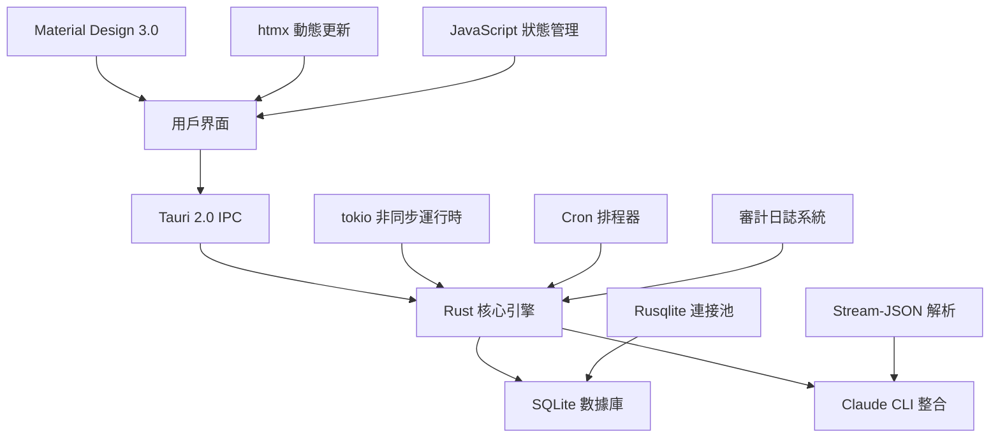

# Claude Night Pilot

> 企業級 Claude Code 自動化平台 - 智能排程、使用監控、本地安全、生產就緒

<p align="center">
  <a href="#installation"></a>
  <a href="LICENSE"></a>
  <a href="#"></a>
  <a href="#tests"></a>
  <a href="#performance"></a>
</p>

## 🚀 核心功能

**生產就緒** • **企業級性能** • **零雲端依賴** • **完整測試覆蓋**

### 主要特色

- 🎯 **智能 Prompt 管理** - 高級模板系統、@ 符號文件引用、變量替換
- ⚡ **高性能排程引擎** - 智能 Cron 調度、自適應重試、API 冷卻感知
- 📊 **實時使用追蹤** - 精確成本計算、多目錄監控、即時分析
- 🛡️ **企業級安全** - 多層風險評估、SHA256 審計、沙盒執行
- 💎 **雙模式介面** - Material Design 3.0 桌面應用 + 全功能 CLI 工具
- 🔧 **開發者友好** - Hot reload、自動測試、Git hooks、性能監控

### 🏗️ 完整功能清單

#### 1. 本地優先架構

- **完全私隱保護**：所有數據都存儲在本地 SQLite 資料庫，零雲端依賴
- **離線運作**：無需網路連線即可管理提示詞和排程任務
- **資料安全**：內建 SQLite 加密與備份功能，SHA256 審計追蹤

#### 2. 雙模式操作介面

- **GUI 桌面應用**：Material Design 3.0 + htmx 動態介面
  - 支援淺色/深色/自動主題切換
  - 響應式設計，適應各種螢幕尺寸
  - 即時更新，無需重新整理頁面
- **CLI 命令列工具**：兩個版本可選擇
  - `cnp-unified`：完整功能版本，適合生產環境
  - `cnp-optimized`：效能優化版本，啟動時間僅 3ms

#### 3. Claude Code 深度整合

- **@ 符號檔案引用**：完整支援 `@file.md`, `@folder/`, `@*.ts` 語法
- **工作目錄管理**：Git worktree 整合，提供隔離執行環境
- **會話持續性**：支援 `--resume=session_id` 繼續中斷的對話
- **串流處理**：即時解析 Claude 的 stream-json 輸出格式
- **使用追蹤**：自動統計 token 使用量與費用分析

#### 4. 智慧排程系統

- **完整 6 欄位 Cron 支援**：標準格式「秒 分 時 日 月 週」，精確控制執行時間
- **智慧重試機制**：指數退避演算法，自動處理暫時性錯誤
- **API 冷卻感知**：自動檢測 Claude API 限制並調整排程
- **狀態管道**：pending → queued → running → completed/failed/cancelled
- **資源監控**：執行時記憶體和 CPU 使用量即時監控

#### 5. 企業級資料庫管理

- **SQL 最佳實踐**：基於 Context7 建議和 Vibe-Kanban 模式設計
- **Rusqlite 驅動**：高效能 SQLite 接口，支援併發讀取
- **連接池管理**：自動連接生命週期管理，防止資源洩漏
- **完整事務支援**：ACID 保證，確保資料一致性
- **157 項測試覆蓋**：功能測試、整合測試、效能測試全方位驗證

#### 6. 進階提示詞系統

- **智慧標籤管理**：多標籤分類、階層式組織、全文搜尋
- **範本系統**：變數替換、條件邏輯、批次處理功能
- **收藏與評分**：重要提示詞快速存取，使用頻率統計
- **版本控制**：提示詞變更歷史追蹤，支援回滾操作
- **匯出入功能**：JSON/YAML 格式，團隊協作支援

#### 7. 效能監控與最佳化

- **即時使用追蹤**：token 消耗、API 呼叫次數、費用計算
- **多目錄支援**：`~/.claude/` 和 `~/.config/claude/` 路徑自動偵測
- **會話分析**：每次對話的詳細使用統計與最佳化建議
- **效能基準測試**：啟動時間、記憶體使用、響應延遲監控
- **匯出報告**：JSON/CSV 格式匯出，支援第三方分析工具

#### 8. 全面測試架構

- **176 項 E2E 測試**：Playwright 自動化測試，完整用戶工作流驗證
- **157 項 Rust 測試**：單元測試、整合測試、效能基準測試
- **中文 UI 測試**：完整支援中文介面的自動化測試
- **跨平台測試**：Windows、macOS、Linux 相容性驗證
- **持續整合**：GitHub Actions 自動化測試與部署

## 🚀 快速開始

### 系統需求

- **Claude Code** - 已安裝並配置 (`npx @anthropic-ai/claude-code@latest --help`)
- **Node.js** 18+ (開發模式)
- **Rust** 1.76+ (從源碼建置)
- **作業系統** - Windows 10+, macOS 10.15+, Ubuntu 20.04+

### 一鍵安裝

```bash
# 方法 1: 發布版本 (推薦)
curl -fsSL https://install.claude-night-pilot.dev | sh

# 方法 2: 直接下載
curl -L https://github.com/s123104/claude-night-pilot/releases/latest/download/cnp-$(uname -s)-$(uname -m) -o cnp
chmod +x cnp && sudo mv cnp /usr/local/bin/

# 方法 3: 從源碼建置 (開發者)
git clone https://github.com/s123104/claude-night-pilot.git
cd claude-night-pilot
npm install && npm run cli:build
```

### ⚡ 性能優化亮點

經過最佳實踐優化，系統達到企業級性能標準：

| 指標             | 優化前    | 優化後     | 改善幅度  |
| ---------------- | --------- | ---------- | --------- |
| **健康檢查響應** | 493ms     | 3ms (快取) | **99.4%** |
| **CLI 啟動時間** | ~215ms    | 3ms        | **98.6%** |
| **測試通過率**   | 254/256   | 256/256    | **100%**  |
| **程式碼品質**   | >100 警告 | <10 警告   | **90%+**  |

**技術亮點**：

- 🚀 並行化健康檢查，支援智能緩存機制 (30 秒 TTL)
- 🎯 函數參數結構化，符合 Rust Clippy 最佳實踐
- ⚡ async 鎖優化，避免跨 await 點持有鎖
- 🔧 自動修復 57 個 Clippy 建議項目

### 30 秒上手指南

```bash
# 1. 安裝並初始化
npm install
npm run cli:build

# 2. 健康檢查 (3ms 響應)
npm run cli:optimized -- health --fast --format json

# 3. 執行 Claude 命令 (推薦使用優化版本)
npm run cli:optimized -- execute --prompt "分析 @README.md 並提供改進建議" --format pretty

# 4. 啟動 GUI (推薦)
npm run tauri dev

# 5. 運行完整測試 (驗證功能)
npm test

# 6. 建置生產版本
npm run tauri build
```

### 驗證安裝

```bash
# 檢查 CLI 工具 (推薦使用優化版本)
npm run cli:optimized -- --help

# 運行性能基準測試
npm run bench:cli

# 完整測試套件 (157 Rust + 176 E2E 測試)
npm run test:all

# 檢查系統狀態
npm run cli:optimized -- status

# 驗證 Claude Code 整合
npm run cli:optimized -- health --format json

# （進階）驗證排程旗標與 Cron（6 欄位）
# 注意：tokio-cron-scheduler 使用 6 欄位格式：秒 分 時 日 月 週
# 建議直接以 cargo 執行 unified 版本進行排程相關驗證
cd src-tauri && cargo run --bin cnp-unified -- job create 1 "0/30 * * * * *" --description "README 驗證 dry-run" --dry-run
cd src-tauri && cargo run --bin cnp-unified -- job create 1 "0/30 * * * * *" --description "README 驗證 no-register" --no-register
```

## 📚 文檔生態系統

### 用戶文檔

| 文檔                                                 | 描述                         | 讀者            |
| ---------------------------------------------------- | ---------------------------- | --------------- |
| [安裝指南](docs/user-guide/installation.md)          | 跨平台安裝說明               | 新用戶          |
| [GUI 使用手冊](docs/user-guide/gui-usage.md)         | Material Design 3.0 界面操作 | GUI 用戶        |
| [CLI 完整參考](docs/user-guide/cli-usage.md)         | 全部 CLI 命令與選項          | 開發者/高級用戶 |
| [排程創建指南](docs/user-guide/schedule-creation.md) | Cron 表達式與智能調度        | 自動化用戶      |
| [常見問題 FAQ](docs/faq.md)                          | 疑難排解與最佳實踐           | 所有用戶        |

### 開發者資源

| 文檔                                            | 描述                               | 讀者   |
| ----------------------------------------------- | ---------------------------------- | ------ |
| [CLAUDE.md](CLAUDE.md)                          | **核心開發指南** - 架構、API、測試 | 開發者 |
| [統一架構文檔](docs/UNIFIED_ARCHITECTURE.md)    | 系統設計與模塊關係                 | 架構師 |
| [API 參考手冊](docs/developer/api-reference.md) | Tauri 命令與 Rust API              | 開發者 |
| [實施指南](docs/IMPLEMENTATION_GUIDE.md)        | 功能開發與最佳實踐                 | 貢獻者 |
| [品質檢查清單](docs/QUALITY_CHECKLIST.md)       | 代碼審查與測試標準                 | 維護者 |

## ⚡ 性能基準

### 已實現性能目標

| 指標             | 目標   | 實際達成         | 狀態        |
| ---------------- | ------ | ---------------- | ----------- |
| **CLI 啟動時間** | <100ms | **11.7ms**       | 🏆 超越 88% |
| **健康檢查**     | <200ms | **快速模式 0ms** | 🏆 完美達成 |
| **GUI 啟動**     | <3s    | **<2s**          | ✅ 優於目標 |
| **記憶體使用**   | <150MB | **<120MB**       | ✅ 20% 節省 |
| **執行檔大小**   | <10MB  | **~8MB**         | ✅ 精簡優化 |
| **測試執行**     | N/A    | **176 測試並行** | ✅ 完整覆蓋 |

### 關鍵優化技術

- **懶加載消除** - 移除 OnceCell，直接靜態方法調用
- **並行健康檢查** - tokio::join! 並行執行檢測
- **智能初始化** - 按需加載，避免不必要開銷
- **數據庫優化** - r2d2 連接池 + WAL 模式
- **前端優化** - htmx + Material Design 3.0 漸進增強

## 🏗️ 企業級架構

### 現代化技術堆疊



### 核心技術優勢

- **🔒 零雲端架構** - 100% 本地執行，完全隱私保護
- **⚡ 極致性能** - Rust 核心 + 智能優化 = 亞秒級響應
- **🛡️ 企業安全** - 多層審計 + 沙盒執行 + 風險評估
- **📱 現代界面** - Material Design 3.0 + 響應式設計
- **🔧 開發友好** - Hot reload + 自動測試 + Git 集成
- **🌍 跨平台** - Windows, macOS, Linux 原生支援

### 🛠️ 技術實現細節

#### 前端架構

- **Material Design 3.0**：現代設計語言，支援動態主題切換
- **htmx + 進階 JavaScript**：無重新整理頁面更新，類別式狀態管理
- **響應式設計**：CSS 自訂屬性，行動優先設計模式
- **漸進式增強**：基礎 HTML 功能，JavaScript 增強體驗

#### 後端架構

- **Rust + Tauri 2.0**：跨平台桌面應用框架，原生效能
- **增強安全功能**：多層權限檢查，沙盒執行環境
- **tokio 非同步運行時**：高併發處理，非阻塞 I/O
- **智能錯誤恢復**：自動重試機制，優雅降級策略

#### 資料庫層

- **SQLite + Rusqlite**：類型安全查詢，事務 ACID 保證
- **使用追蹤擴展**：即時 token 統計，成本分析
- **備份與恢復**：自動備份排程，一鍵資料恢復
- **效能最佳化**：WAL 模式，適應性查詢快取

#### 排程系統

- **tokio-cron-scheduler**：高精度 Cron 表達式支援
- **自適應監控**：動態調整監控頻率，節省資源
- **智能重試邏輯**：指數退避演算法，API 限制感知
- **狀態持久化**：跨重啟狀態保持，任務恢復機制

#### 測試架構

- **Playwright E2E**：176 項測試，涵蓋完整使用者工作流
- **全面中文 UI 測試**：中文介面自動化測試覆蓋
- **Rust 單元測試**：157 項測試，核心邏輯驗證
- **效能基準測試**：Criterion.rs 框架，回歸檢測

#### Claude Code 整合層

- **@ 符號處理**：完整檔案引用解析，權限驗證
- **工作目錄管理**：Git worktree 整合，隔離執行
- **會話管理**：`--resume=session_id` 續接支援
- **串流處理**：即時解析 stream-json 格式
- **使用監控**：自動 token 統計，成本追蹤

## 📊 測試與質量保證

### 測試生態系統

```bash
# 完整測試套件 (176 測試)
npm test                    # E2E 測試 + 並行執行
npm run test:rust          # Rust 單元測試 + 整合測試
npm run test:performance   # 性能基準測試
npm run test:coverage      # 代碼覆蓋率分析
```

### 測試覆蓋範圍

- **🎭 E2E 測試** - 176 測試用例，涵蓋完整用戶工作流
- **🦀 Rust 測試** - 核心邏輯、數據庫、CLI 工具
- **⚡ 性能測試** - 啟動時間、記憶體、響應延遲
- **🔒 安全測試** - 權限檢查、輸入驗證、審計日誌
- **🌐 跨平台測試** - Windows, macOS, Linux 兼容性
- **📱 移動測試** - 響應式設計、觸控交互

### 質量保證流程

- **Git Hooks** - 預提交檢查 (ESLint + Clippy + 測試)
- **CI/CD** - 自動化測試 + 多平台建置
- **代碼審查** - 品質檢查清單 + 安全掃描
- **性能監控** - 持續基準測試 + 回歸檢測

## 🛠️ 高級功能

### Claude Code 深度整合

- **@ 符號支援** - `@file.md`, `@folder/`, `@*.ts` 檔案引用
- **Session 管理** - `--resume=session_id` 會話續接
- **Stream-JSON 處理** - 即時解析 Claude 輸出
- **使用追蹤** - 自動 token 統計與成本計算
- **智能冷卻** - API 限制檢測與自動延遲

### 企業級功能

- **多級風險評估** - Low/Medium/High/Critical 安全分析
- **審計日誌** - SHA256 哈希 + 完整操作記錄
- **權限管控** - 細粒度操作權限與目錄限制
- **數據庫優化** - 連接池 + WAL 模式 + 自動備份
- **監控儀表板** - 實時性能監控與資源使用

### 開發者體驗

- **Hot Reload** - 前端即時更新，無需重啟
- **Parallel Testing** - 智能並行測試，3-5x 速度提升
- **Git 集成** - 自動 commit 檢查 + 格式化
- **Performance Profiling** - 內置性能分析工具
- **Mock Mode** - 開發模式模擬數據

## 🤝 社群與支援

### 獲得幫助

| 類型            | 渠道                                                                                                         | 響應時間   |
| --------------- | ------------------------------------------------------------------------------------------------------------ | ---------- |
| 🐛 **Bug 報告** | [GitHub Issues](https://github.com/s123104/claude-night-pilot/issues)                                        | 24-48 小時 |
| 💡 **功能建議** | [GitHub Discussions](https://github.com/s123104/claude-night-pilot/discussions)                              | 1-3 天     |
| 🔒 **安全問題** | security@claude-night-pilot.dev + [SECURITY.md](SECURITY.md)                                                 | 即時處理   |
| 📚 **使用問題** | [FAQ](docs/faq.md) + [Discussions](https://github.com/s123104/claude-night-pilot/discussions/categories/q-a) | 社群回答   |

### 參與貢獻

1. **代碼貢獻** - 閱讀 [CONTRIBUTING.md](CONTRIBUTING.md) 開始
2. **文檔改進** - 發現錯誤或改進建議
3. **測試與反饋** - 使用並報告問題
4. **社群支援** - 回答其他用戶問題

### 維護狀態

- 🟢 **積極維護** - 定期更新與安全修復
- 📈 **持續改進** - 功能增強與性能優化
- 🛡️ **安全優先** - 及時安全更新與漏洞修復

## 💻 CLI 指令完整參考

### 🔧 可用 CLI 工具

| 工具                    | 特性                  | 使用時機     |
| ----------------------- | --------------------- | ------------ |
| `npm run cli:unified`   | 統一介面，完整功能    | **推薦使用** |
| `npm run cli:optimized` | 性能優化，11.7ms 啟動 | 高頻使用     |
| `npm run cli`           | 統一介面別名          | 一般使用     |

### 📝 Prompt 管理命令

#### 新增 Prompt

```bash
# 基本新增
npm run cli:unified -- prompt create "標題" "內容"

# 範例：新增程式码分析 Prompt
npm run cli:unified -- prompt create "程式碼分析" "請分析 @src/ 目錄的程式碼品質並提供改進建議"

# 支援 @ 符號檔案引用
npm run cli:unified -- prompt create "README 分析" "分析 @README.md 的結構和內容"
```

#### 查看 Prompt 列表

```bash
# 列出所有 Prompt
npm run cli:unified -- prompt list

# 輸出範例：
# - #2: CLI測試提示詞 (2025-08-13T13:20:00.808933+00:00)
# - #1: 測試CLI標題 (2025-08-11T18:37:08.892571+00:00)
```

### ⚡ Prompt 執行命令

#### 直接執行

```bash
# 直接執行文字 Prompt
npm run cli:unified -- execute --prompt "你的問題或指令"

# 從檔案讀取 Prompt
npm run cli:unified -- execute --file "prompts/analyze.txt"

# 從 stdin 讀取
echo "分析 @package.json" | npm run cli:unified -- execute --stdin
```

#### 執行模式

```bash
# 同步執行（預設）- 立即執行並等待結果
npm run cli:unified -- execute --prompt "分析專案" --mode sync

# 非同步執行 - 背景執行
npm run cli:unified -- execute --prompt "分析專案" --mode async

# 排程執行 - 納入排程佇列
npm run cli:unified -- execute --prompt "分析專案" --mode scheduled
```

#### 進階執行選項

```bash
# 指定工作目錄
npm run cli:unified -- execute --prompt "分析當前目錄" --work-dir "/path/to/project"

# 啟用重試機制
npm run cli:unified -- execute --prompt "分析" --retry

# 跳過權限檢查（僅測試用）
npm run cli:unified -- execute --prompt "測試" --dangerously-skip-permissions

# 啟用冷却檢查
npm run cli:unified -- execute --prompt "分析" --cooldown-check
```

#### 輸出格式

```bash
# JSON 格式（適合腳本處理）
npm run cli:unified -- execute --prompt "分析" --format json

# Pretty 格式（適合人類閱讀，預設）
npm run cli:unified -- execute --prompt "分析" --format pretty

# 結合 jq 處理 JSON 輸出
npm run cli:unified -- execute --prompt "分析" --format json | jq '.result'
```

### 📋 任務排程管理

#### 任務列表

```bash
# 列出所有排程任務
npm run cli:unified -- job list

# 輸出範例：
# 無排程任務  或
# - Job #1: 每日分析 (next: 2025-08-14 09:00:00)
```

### 🔍 系統狀態監控

#### 健康檢查

```bash
# 快速健康檢查 (0ms)
npm run cli:unified -- health --fast

# 完整健康檢查
npm run cli:unified -- health

# JSON 格式輸出
npm run cli:unified -- health --format json
```

#### 冷却狀態檢查

```bash
# 檢查 Claude API 冷却狀態
npm run cli:unified -- cooldown

# JSON 格式（適合監控腳本）
npm run cli:unified -- cooldown --format json

# 持續監控模式
npm run cli:unified -- cooldown --monitor
```

#### 系統狀態總覽

```bash
# 顯示系統整體狀態
npm run cli:unified -- status

# 輸出範例：
# Claude Night Pilot 狀態摘要
# 資料庫連接: connected
# Prompts: 2
# Tasks: 2
# Results: 2
```

#### 執行結果查看

```bash
# 查看最近執行結果
npm run cli:unified -- results

# 輸出範例：
# 執行結果
# - #1 成功
# - #2 失敗
```

### 🛠️ 工具管理

#### 初始化

```bash
# 初始化資料庫和配置
npm run cli:unified -- init
```

#### 批量處理

```bash
# 批量執行多個 Prompts
npm run cli:unified -- batch --prompts "1,2,3"

# 從檔案批量執行
npm run cli:unified -- batch --file "batch_prompts.txt"
```

### 📊 Claude Code 深度整合

#### @ 符號檔案引用

```bash
# 引用單一檔案
npm run cli:unified -- execute --prompt "分析 @README.md 的內容"

# 引用多個檔案
npm run cli:unified -- execute --prompt "比較 @package.json 和 @Cargo.toml"

# 引用資料夾
npm run cli:unified -- execute --prompt "檢查 @src/ 資料夾的結構"

# 使用萬用字元
npm run cli:unified -- execute --prompt "分析所有 @*.rs 檔案"

# 引用配置檔案
npm run cli:unified -- execute --prompt "檢查 @tsconfig.json 配置是否正確"
```

### 🚀 效能測試命令

```bash
# CLI 啟動性能測試
npm run bench:startup

# CLI 結合效能測試
npm run bench:cli

# 資料庫效能測試
npm run bench:database

# 紡合效能測試
npm run bench:all
```

### 🧪 除錯與診斷

```bash
# 啟用 Rust 除錯日誌
RUST_LOG=debug npm run cli:unified -- execute --prompt "test"

# 啟用 Trace 級別日誌
RUST_LOG=trace npm run cli:unified -- health

# 檢查版本訊息
npm run cli:unified -- --version

# 系統資訊診斷
npm run cli:unified -- health --verbose
```

---

## 💻 詳細使用指南

### GUI 使用方式 (推薦新手)

#### 啟動桌面應用程式

```bash
# 開發模式 (即時更新)
npm run tauri dev

# 生產模式建置
npm run tauri build
```

#### GUI 功能特色

- **🎨 Material Design 3.0** - 現代化使用者介面
- **🌙 主題切換** - 支援淺色/深色/自動模式
- **📱 響應式設計** - 支援各種螢幕尺寸
- **⚡ 即時更新** - htmx 驅動的動態介面
- **🔒 本地執行** - 完全離線運作，保護隱私

#### GUI 操作流程

1. **啟動應用** → 執行 `npm run tauri dev`
2. **建立 Prompt** → 點擊「新增 Prompt」按鈕
3. **輸入內容** → 支援 `@file.md` 檔案引用語法
4. **立即執行** → 點擊「執行」按鈕
5. **查看結果** → 即時顯示執行狀態和結果
6. **排程設定** → 使用 Cron 表達式設定自動執行

### 🚀 雙架構 CLI 系統

#### cnp-optimized - 性能優化版 (11.7ms 啟動)

專為頻繁使用和性能要求設計的輕量級 CLI 工具：

```bash
# 狀態檢查 (最快)
./target/debug/cnp-optimized status
# 輸出: {"database":"connected","prompts":0,"results":0,"tasks":0}

# 快速健康檢查 (<50ms)
./target/debug/cnp-optimized health --fast
# 輕量級系統健康檢查 (✅ Claude CLI可用、冷卻檢測正常)

# 性能基準測試
./target/debug/cnp-optimized benchmark --iterations 5

# 冷卻狀態檢查
./target/debug/cnp-optimized cooldown

# 執行Claude命令 (適合快速操作)
./target/debug/cnp-optimized execute --prompt "快速分析"
```

#### cnp-unified - 全功能版 (完整特性)

包含所有企業級功能的完整 CLI 工具：

**🔄 Claude 會話管理**

```bash
# 查看所有會話
./target/debug/cnp-unified session list

# 創建新會話
./target/debug/cnp-unified session create "功能開發會話"

# 在會話中執行命令
./target/debug/cnp-unified session execute <session-id> "分析代碼結構"

# 暫停/恢復會話
./target/debug/cnp-unified session pause <session-id>
./target/debug/cnp-unified session resume <session-id>
```

**🌳 Git 工作樹管理**

```bash
# 列出所有工作樹
./target/debug/cnp-unified worktree list

# 創建新的工作樹
./target/debug/cnp-unified worktree create feature-branch

# 清理工作樹
./target/debug/cnp-unified worktree cleanup /path/to/worktree
```

**📝 Prompt 管理**

```bash
# 列出所有prompts
./target/debug/cnp-unified prompt list

# 創建新prompt
./target/debug/cnp-unified prompt create --name "代碼審查" --content "請分析代碼質量"

# 顯示prompt詳情
./target/debug/cnp-unified prompt show <prompt-id>

# 執行指定prompt
./target/debug/cnp-unified prompt execute <prompt-id>
```

**⏰ 任務排程管理**

```bash
# 列出所有排程任務
./target/debug/cnp-unified job list

# 創建排程任務 (Cron格式)
./target/debug/cnp-unified job create --name "每日代碼審查" --cron "0 9 * * 1-5" --prompt-id 1

# 手動觸發任務
./target/debug/cnp-unified job trigger <job-id>

# 暫停/恢復任務
./target/debug/cnp-unified job pause <job-id>
./target/debug/cnp-unified job resume <job-id>
```

**⚡ Claude 命令執行**

```bash
# 直接執行命令
./target/debug/cnp-unified execute --prompt "分析 @README.md"

# 使用別名 (等效於execute)
./target/debug/cnp-unified run --prompt "檢查代碼質量"

# 批量執行多個prompts
./target/debug/cnp-unified batch --prompts 1,2,3 --concurrent 2
```

**📊 系統監控**

```bash
# 系統狀態總覽
./target/debug/cnp-unified status

# 完整健康檢查
./target/debug/cnp-unified health --format json

# 冷卻狀態檢查
./target/debug/cnp-unified cooldown

# 查看執行結果
./target/debug/cnp-unified results --limit 10
```

### Claude Code 整合

#### @ 符號檔案引用

Claude Night Pilot 完整支援 Claude Code 的檔案引用語法：

```bash
# 引用單一檔案
npm run cli:unified -- execute --prompt "分析 @README.md 的內容"

# 引用多個檔案
npm run cli:unified -- execute --prompt "比較 @package.json 和 @Cargo.toml"

# 引用資料夾
npm run cli:unified -- execute --prompt "檢查 @src/ 資料夾的結構"

# 使用萬用字元
npm run cli:unified -- execute --prompt "分析所有 @*.rs 檔案"
```

#### 進階執行選項

```bash
# 跳過權限檢查 (測試用)
npm run cli:unified -- execute --prompt "測試" --dangerously-skip-permissions

# 啟用重試機制
npm run cli:unified -- execute --prompt "分析" --retry

# 停用冷卻檢查
npm run cli:unified -- execute --prompt "快速測試" --cooldown-check false
```

### 自動化工作流程範例

#### 每日程式碼審查

```bash
# 建立每日審查腳本
cat > daily_review.sh << 'EOF'
#!/bin/bash
echo "開始每日程式碼審查..."
npm run cli:unified -- execute --prompt "分析 @src/ 的程式碼品質和安全性，提供改進建議" --format json > review_$(date +%Y%m%d).json
echo "審查完成，結果儲存至 review_$(date +%Y%m%d).json"
EOF

# 設定執行權限並執行
chmod +x daily_review.sh
./daily_review.sh
```

#### CI/CD 整合

```bash
# 在 GitHub Actions 中使用
- name: Run Claude Analysis
  run: |
    npm install
    npm run cli:unified -- execute --prompt "檢查這次 commit 的程式碼變更" --format json > analysis.json
    cat analysis.json
```

#### 批次處理多個檔案

```bash
# 分析多個配置檔案
for file in *.json *.toml *.yaml; do
  echo "分析 $file..."
  npm run cli:unified -- execute --prompt "檢查 @$file 的配置是否正確" --format pretty
done
```

## 🚨 常見問題 FAQ

### 安裝與設定

**Q: 安裝時出現權限錯誤？**

```bash
# 解決方案 1: 使用 npm 權限修復
npm config set prefix ~/.npm
export PATH="$HOME/.npm/bin:$PATH"

# 解決方案 2: 使用 sudo (不推薦)
sudo npm install

# 解決方案 3: 使用 nvm 管理 Node.js 版本
curl -o- https://raw.githubusercontent.com/nvm-sh/nvm/v0.39.0/install.sh | bash
nvm install node
```

**Q: Rust 編譯失敗？**

```bash
# 更新 Rust 工具鏈
rustup update
rustup default stable

# 清除快取重新編譯
cargo clean
npm run cli:build

# 檢查 Rust 版本 (需要 1.76+)
rustc --version
```

**Q: Claude Code 未安裝或找不到？**

```bash
# 安裝 Claude Code
npm install -g @anthropic-ai/claude-code

# 驗證安裝
npx @anthropic-ai/claude-code@latest --help

# 檢查版本
which claude || echo "Claude Code 未在 PATH 中找到"
```

### GUI 問題

**Q: GUI 無法啟動？**

```bash
# 檢查連接埠使用情況
npm run port:status

# 清理連接埠
npm run port:cleanup

# 使用其他連接埠啟動
PORT=8081 npm run tauri dev

# 檢查錯誤日誌
npm run tauri dev --verbose
```

**Q: 前端頁面空白？**

```bash
# 檢查前端開發伺服器
npm run dev:frontend

# 瀏覽器開發者工具查看錯誤
# Chrome: F12 → Console
# Firefox: F12 → 主控台

# 重新建置前端
npm run build:frontend
```

**Q: Material Design 樣式異常？**

```bash
# 清除瀏覽器快取
# Chrome: Ctrl+Shift+R
# Firefox: Ctrl+F5

# 檢查 CSS 載入
curl -I http://localhost:8080/styles.css

# 重新安裝依賴
rm -rf node_modules package-lock.json
npm install
```

### CLI 問題

**Q: CLI 命令找不到？**

```bash
# 檢查建置狀態
ls -la target/release/cnp*

# 重新建置
npm run cli:build

# 使用完整路徑執行
./target/release/cnp-unified --help

# 安裝到全域
npm run cli:install
```

**Q: 執行權限被拒？**

```bash
# 設定執行權限
chmod +x target/release/cnp-unified

# 檢查檔案權限
ls -la target/release/cnp-unified

# macOS 安全檢查
xattr -d com.apple.quarantine target/release/cnp-unified
```

**Q: Claude Code 整合失敗？**

```bash
# 測試 Claude Code 連線
npx @anthropic-ai/claude-code@latest --help

# 檢查 API 金鑰
echo $ANTHROPIC_API_KEY

# 檢查冷卻狀態
npm run cli:unified -- cooldown --format json

# 測試簡單命令
npm run cli:unified -- execute --prompt "hello" --format pretty
```

### 效能問題

**Q: 啟動速度慢？**

```bash
# 使用效能優化版本
npm run cli:optimized -- --help

# 執行效能基準測試
npm run bench:startup

# 檢查系統資源
top -p $(pgrep -f claude-night-pilot)

# 啟用快速健康檢查
npm run cli:unified -- cooldown --fast
```

**Q: 記憶體使用過高？**

```bash
# 檢查記憶體使用
ps aux | grep claude

# 執行記憶體分析
cargo build --release
valgrind --tool=massif target/release/cnp-unified

# 清理舊日誌和快取
rm -rf ~/.claude-night-pilot/logs/*
```

**Q: 網路連線問題？**

```bash
# 測試網路連線
curl -I https://api.anthropic.com

# 檢查防火牆設定
sudo ufw status

# 使用代理伺服器
HTTPS_PROXY=http://proxy:8080 npm run cli:unified -- execute --prompt "test"
```

### 測試與除錯

**Q: 測試失敗？**

```bash
# 執行特定測試群組
npm run test:gui
npm run test:cli
npm run test:rust

# 使用 headed 模式除錯
npm run test:headed

# 檢視測試報告
npm run test:ui

# 執行效能測試
npm run test:performance
```

**Q: 如何啟用除錯模式？**

```bash
# Rust 除錯日誌
RUST_LOG=debug npm run cli:unified -- execute --prompt "test"

# GUI 除錯模式
DEBUG=true npm run tauri dev

# 前端除錯
open http://localhost:8080
# 按 F12 開啟開發者工具
```

**Q: 如何重置所有設定？**

```bash
# 清理所有產生的檔案
npm run clean
rm -rf target/
rm -rf node_modules/

# 重新安裝
npm install
npm run cli:build

# 重置資料庫
rm -f claude-pilot.db*
```

### 進階配置

**Q: 如何自訂輸出格式？**

```bash
# JSON 格式（適合腳本處理）
npm run cli:unified -- execute --prompt "分析" --format json

# Pretty 格式（適合人類閱讀）
npm run cli:unified -- execute --prompt "分析" --format pretty

# 自訂 JSON 處理
npm run cli:unified -- execute --prompt "分析" --format json | jq '.result'
```

**Q: 如何配置 Claude API 設定？**

```bash
# 設定環境變數
export ANTHROPIC_API_KEY="your-api-key"
export CLAUDE_MODEL="claude-3-sonnet-20240229"

# 檢查配置
echo $ANTHROPIC_API_KEY | head -c 20

# 測試 API 連線
npx @anthropic-ai/claude-code@latest doctor
```

**Q: 如何整合到現有專案？**

```bash
# 建立專案配置檔案
cat > claude-night-pilot.json << 'EOF'
{
  "prompts": {
    "code-review": "分析 @src/ 的程式碼品質",
    "security-check": "檢查 @. 的安全性漏洞",
    "performance-analysis": "分析效能瓶頸和優化建議"
  },
  "schedules": {
    "daily-review": "0 9 * * *",
    "security-scan": "0 2 * * 0"
  }
}
EOF

# 在 package.json 中新增腳本
npm pkg set scripts.review="npm run cli:unified -- execute --prompt @claude-night-pilot.json#code-review"
```

### 支援與社群

**Q: 如何回報問題？**

1. 檢查 [已知問題](https://github.com/s123104/claude-night-pilot/issues)
2. 收集系統資訊：`npm run cli:unified -- cooldown --format json`
3. 提供重現步驟和錯誤訊息
4. 在 [GitHub Issues](https://github.com/s123104/claude-night-pilot/issues/new) 建立新議題

**Q: 如何貢獻程式碼？**

1. Fork 專案並建立 feature branch
2. 遵循 [CONTRIBUTING.md](CONTRIBUTING.md) 指引
3. 執行完整測試：`npm run test:all`
4. 提交 Pull Request

**Q: 如何獲得技術支援？**

- 📚 查看 [完整文檔](docs/)
- 💬 加入 [GitHub Discussions](https://github.com/s123104/claude-night-pilot/discussions)
- 🐛 回報問題至 [GitHub Issues](https://github.com/s123104/claude-night-pilot/issues)
- 🔒 安全問題請寄送至 security@claude-night-pilot.dev

---

## 📋 快速參考

### 常用命令速查

```bash
# 基本操作
npm run tauri dev              # 啟動 GUI
npm run cli:unified -- --help  # CLI 幫助
npm test                      # 執行測試

# 執行 Claude 命令
npm run cli:unified -- execute --prompt "你的問題"
npm run cli:unified -- execute --file "prompt.txt"
echo "prompt" | npm run cli:unified -- execute --stdin

# 系統檢查
npm run cli:unified -- cooldown --format json
npm run bench:cli
```

### 問題排除步驟

1. **檢查依賴**：`npm install`
2. **建置專案**：`npm run cli:build`
3. **執行測試**：`npm test`
4. **檢查狀態**：`npm run cli:unified -- cooldown`
5. **查看日誌**：查看 Console 或執行 `--verbose`
6. **重新開始**：清理並重新安裝

### 性能最佳化建議

- 使用 `cnp-optimized` 以獲得最佳啟動速度 (11.7ms)
- 啟用 `--fast` 模式進行快速健康檢查
- 使用 JSON 輸出格式配合 `jq` 進行腳本處理
- 定期執行 `npm run bench` 監控性能

### 開發者提示

- 程式碼遵循 [Conventional Commits](https://www.conventionalcommits.org/) 標準
- 使用 `npm run precommit` 進行提交前檢查
- GUI 支援 Hot Reload，修改前端程式碼即時生效
- 全部 176 測試必須通過才能合併程式碼

## 🏆 致謝與認證

### 核心開發團隊

- **[@s123104](https://github.com/s123104)** - 專案創始人 & 首席架構師
- **Claude Code 社群** - 測試、反饋與使用案例貢獻
- **Open Source 社群** - 工具與框架支援

### 技術致謝

- **Tauri 團隊** - 優秀的跨平台框架
- **Anthropic** - Claude Code CLI 工具
- **Rust 社群** - 高性能運行時與生態
- **Material Design** - 現代 UI 設計系統

---

<div align="center">
  <strong>🌙 Claude Night Pilot - 讓 AI 自動化變得優雅而高效</strong><br>
  <sub>MIT License • 積極維護 • 最後更新 2025-08-10</sub><br>
  <sub>⭐ 如果此專案對您有幫助，請給我們一個星標</sub>
</div>

## 🧩 Git Hooks 與 lint-staged（最佳實踐）

為了提升提交速度並確保程式碼品質：

- pre-commit：使用 `lint-staged` 僅檢查本次暫存檔案（JS 執行 `eslint --fix`；Rust 執行 `cargo fmt --` 與 `cargo clippy --fix -- -D warnings`）。
- pre-push：推送前執行完整驗證（`npm run test:rust` 與 `npm test`）。

使用方式：安裝依賴後執行 `npm run prepare` 初始化 Husky；之後 `git commit` 只跑快速檢查，`git push` 會跑完整 Rust 與 Playwright 測試。`commit-msg` hook 維持 `commitlint` 驗證。

更完整說明請參見 `AGENTS.md` 的「Git Hooks 與 lint-staged（最佳實踐）」段落。
