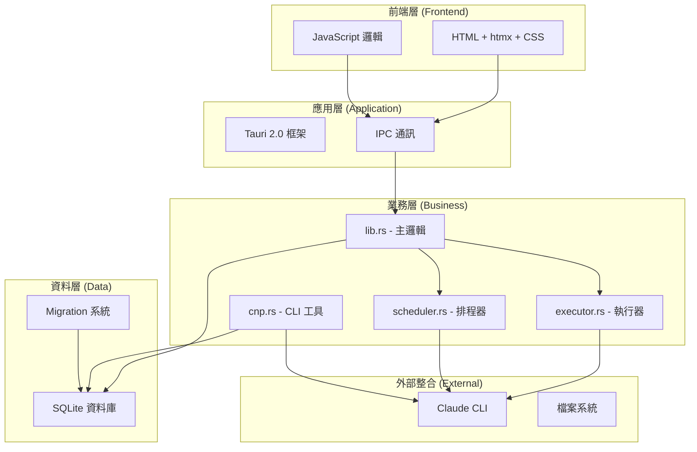

# 🏗️ Claude Night Pilot - 專案規則與開發指南

> **文件建立時間**: 2025-07-23T03:14:08+08:00  
> **更新時間**: 2025-07-23T03:14:08+08:00  
> **版本**: v2.0.0 - 開源專案標準版  
> **適用範圍**: 所有貢獻者與維護者

---

## 📋 目錄

1. [專案概述](#專案概述)
2. [技術架構](#技術架構)
3. [開發環境](#開發環境)
4. [程式碼規範](#程式碼規範)
5. [測試策略](#測試策略)
6. [版本管理](#版本管理)
7. [部署流程](#部署流程)
8. [貢獻流程](#貢獻流程)
9. [安全性要求](#安全性要求)
10. [效能標準](#效能標準)

---

## 🎯 專案概述

### 核心目標

Claude Night Pilot 是一個現代化的 Claude CLI 自動化工具，致力於：

- **零雲端依賴** - 完全本地運行，保護使用者隱私
- **極致輕量** - 單一執行檔 < 10MB，啟動時間 < 3s
- **雙模式操作** - GUI 與 CLI 並重，滿足不同使用習慣
- **高度可維護** - 清晰的架構設計，完整的測試覆蓋

### 專案價值

| 價值面向       | 具體表現             |
| -------------- | -------------------- |
| **使用者體驗** | 零學習曲線，直觀操作 |
| **開發體驗**   | 清晰文檔，標準化流程 |
| **技術品質**   | 現代技術棧，最佳實踐 |
| **社群價值**   | 開源貢獻，知識分享   |

---

## 🏗️ 技術架構

### 系統架構圖



### 技術棧規範

| 層級         | 技術選擇   | 版本要求   | 備註           |
| ------------ | ---------- | ---------- | -------------- |
| **桌面框架** | Tauri      | 2.0+       | 跨平台應用框架 |
| **後端語言** | Rust       | 1.76+      | 系統程式語言   |
| **前端技術** | htmx + CSS | 1.9+       | 極簡前端棧     |
| **資料庫**   | SQLite     | 3.35+      | 嵌入式資料庫   |
| **測試框架** | Playwright | 1.40+      | E2E 測試       |
| **建置工具** | npm/cargo  | 最新穩定版 | 包管理器       |

---

## 🛠️ 開發環境

### 環境需求

#### 基本需求

```bash
# Node.js - 建議使用 LTS 版本
node --version  # >= 18.0.0
npm --version   # >= 9.0.0

# Rust - 使用最新穩定版
rustc --version  # >= 1.76.0
cargo --version  # >= 1.76.0

# Claude CLI - 必須已安裝並配置
claude --version  # 最新版本
```

#### 開發工具建議

```bash
# VS Code 擴展
- rust-analyzer
- Tauri
- ES6 String HTML
- Playwright Test for VS Code
- GitLens

# 可選工具
- cargo-watch    # 自動重建
- cargo-audit    # 安全掃描
- cargo-bloat    # 分析二進位大小
```

### 環境設定

#### 1. 克隆專案

```bash
git clone https://github.com/s123104/claude-night-pilot.git
cd claude-night-pilot
```

#### 2. 安裝依賴

```bash
# 安裝 Node.js 依賴
npm install

# 檢查 Rust 工具鏈
cargo check
```

#### 3. 開發環境驗證

```bash
# 執行測試確保環境正常
npm test

# 啟動開發模式
npm run tauri dev
```

---

## 📝 程式碼規範

### Rust 程式碼規範

#### 格式化與檢查

```bash
# 程式碼格式化
cargo fmt

# 程式碼檢查 (無警告通過)
cargo clippy -- -D warnings

# 安全掃描
cargo audit
```

#### 命名規範

```rust
// ✅ 良好的命名
struct PromptManager {
    database_pool: SqlitePool,
    claude_executor: ClaudeExecutor,
}

impl PromptManager {
    pub async fn create_prompt(&self, title: &str, content: &str) -> Result<i64> {
        // 實作邏輯
    }
}

// ❌ 避免的命名
struct PM {
    db: SqlitePool,  // 縮寫不清楚
    ex: ClaudeExecutor,
}
```

#### 錯誤處理

```rust
// ✅ 使用 Result 類型
use anyhow::{Context, Result};

pub async fn execute_prompt(prompt_id: i64) -> Result<String> {
    let prompt = get_prompt(prompt_id)
        .await
        .context("Failed to fetch prompt")?;

    let result = claude_cli::execute(&prompt.content)
        .await
        .context("Claude CLI execution failed")?;

    Ok(result)
}

// ❌ 避免 panic!
pub async fn execute_prompt(prompt_id: i64) -> String {
    let prompt = get_prompt(prompt_id).await.unwrap(); // 不要這樣做
    // ...
}
```

### JavaScript 程式碼規範

#### ES6+ 語法

```javascript
// ✅ 使用現代 JavaScript
class AppState {
  constructor() {
    this.prompts = [];
    this.currentTab = "prompts";
  }

  async loadPrompts() {
    try {
      const prompts = await invoke("list_prompts");
      this.prompts = prompts;
    } catch (error) {
      console.error("Failed to load prompts:", error);
      showError("載入 Prompts 失敗");
    }
  }

  // 使用箭頭函數
  updateUI = () => {
    this.renderPrompts();
    this.updateStatusBar();
  };
}

// ✅ 模組化
const PromptManager = {
  async create(title, content, tags) {
    return await invoke("create_prompt", { title, content, tags });
  },

  async list() {
    return await invoke("list_prompts");
  },
};
```

#### HTML 與 CSS 規範

```html
<!-- ✅ 語意化 HTML -->
<main class="app-container">
  <section class="prompt-management" id="prompt-section">
    <header class="section-header">
      <h2>Prompt 管理</h2>
      <button class="btn-primary" onclick="createPrompt()">新增 Prompt</button>
    </header>

    <div class="prompt-list" id="prompt-list">
      <!-- 動態內容 -->
    </div>
  </section>
</main>
```

```css
/* ✅ 清晰的 CSS 結構 */
.app-container {
  display: grid;
  grid-template-areas:
    "header header"
    "sidebar main";
  height: 100vh;
}

.prompt-management {
  grid-area: main;
  padding: 1rem;
}

.section-header {
  display: flex;
  justify-content: space-between;
  align-items: center;
  margin-bottom: 1rem;
}

/* 響應式設計 */
@media (max-width: 768px) {
  .app-container {
    grid-template-areas:
      "header"
      "main";
  }
}
```

---

## 🧪 測試策略

### 測試金字塔

```
    /\
   /  \     E2E Tests (少量但全面)
  /____\    - Playwright 整合測試
 /      \   Integration Tests (中等數量)
/________\  - Rust 模組測試
/__________\ Unit Tests (大量且快速)
            - 函數邏輯測試
```

### 測試類型與覆蓋率要求

| 測試類型     | 框架             | 覆蓋率要求 | 執行頻率 |
| ------------ | ---------------- | ---------- | -------- |
| **單元測試** | Rust 內建 + Jest | > 90%      | 每次提交 |
| **整合測試** | Rust + Tauri     | > 80%      | 每次 PR  |
| **E2E 測試** | Playwright       | > 70%      | 每次發布 |
| **效能測試** | 自定義腳本       | 關鍵指標   | 每週     |

### 測試命名規範

```rust
// ✅ Rust 測試命名
#[cfg(test)]
mod tests {
    use super::*;

    #[tokio::test]
    async fn test_create_prompt_success() {
        // 測試成功案例
    }

    #[tokio::test]
    async fn test_create_prompt_with_empty_title_fails() {
        // 測試失敗案例
    }

    #[tokio::test]
    async fn test_create_prompt_with_special_characters() {
        // 測試邊界案例
    }
}
```

```javascript
// ✅ E2E 測試命名
describe("Prompt 管理功能", () => {
  test("應該能夠建立新的 Prompt", async ({ page }) => {
    // 測試邏輯
  });

  test("應該能夠刪除現有的 Prompt", async ({ page }) => {
    // 測試邏輯
  });

  test("應該在輸入無效資料時顯示錯誤訊息", async ({ page }) => {
    // 錯誤處理測試
  });
});
```

---

## 🔄 版本管理

### 語義化版本控制

採用 [Semantic Versioning 2.0.0](https://semver.org/) 標準：

```
版本格式: MAJOR.MINOR.PATCH

MAJOR: 不向後相容的 API 變更
MINOR: 向後相容的新功能
PATCH: 向後相容的錯誤修復
```

### Git 工作流程

#### 分支策略

```bash
main              # 生產分支，隨時可部署
├── develop       # 開發分支，整合最新功能
├── feature/      # 功能分支
├── bugfix/       # 錯誤修復分支
├── hotfix/       # 緊急修復分支
└── release/      # 發布準備分支
```

#### 提交訊息規範

使用 [Conventional Commits](https://conventionalcommits.org/) 格式：

```bash
# 格式
<type>(<scope>): <description>

[optional body]

[optional footer(s)]

# 範例
feat(prompt): add batch create functionality

- Support creating multiple prompts at once
- Add validation for batch operations
- Update UI to handle batch mode

Closes #123
```

#### 提交類型

| 類型              | 說明       | 版本影響 |
| ----------------- | ---------- | -------- |
| `feat`            | 新功能     | MINOR    |
| `fix`             | 錯誤修復   | PATCH    |
| `docs`            | 文檔變更   | 無       |
| `style`           | 程式碼格式 | 無       |
| `refactor`        | 重構       | PATCH    |
| `perf`            | 效能改善   | PATCH    |
| `test`            | 測試相關   | 無       |
| `chore`           | 維護工作   | 無       |
| `ci`              | CI 設定    | 無       |
| `BREAKING CHANGE` | 破壞性變更 | MAJOR    |

---

## 🚀 部署流程

### 建置流程

#### 開發建置

```bash
# 開發模式
npm run tauri dev

# 檢查品質
npm run lint
npm test
```

#### 生產建置

```bash
# 清理環境
npm run clean

# 安裝依賴
npm ci

# 執行完整測試
npm run test:all

# 建置應用
npm run tauri build

# 驗證建置
npm run verify-build
```

### 發布檢查清單

#### 預發布檢查

- [ ] 所有測試通過 (`npm test`)
- [ ] 程式碼品質檢查通過 (`npm run lint`)
- [ ] 安全掃描通過 (`cargo audit`)
- [ ] 效能指標符合要求
- [ ] 文檔已更新
- [ ] CHANGELOG.md 已更新

#### 發布步驟

```bash
# 1. 確認版本號
npm version patch|minor|major

# 2. 更新 Cargo.toml 版本
# 手動編輯 src-tauri/Cargo.toml

# 3. 建置並測試
npm run tauri build
npm run test:e2e

# 4. 建立發布標籤
git tag -a v1.0.0 -m "Release version 1.0.0"

# 5. 推送變更
git push origin main --tags

# 6. 建立 GitHub Release
# 透過 GitHub Actions 自動化
```

### 平台特定建置

```bash
# macOS (Universal Binary)
npm run tauri build -- --target universal-apple-darwin

# Windows (x64)
npm run tauri build -- --target x86_64-pc-windows-msvc

# Linux (x64)
npm run tauri build -- --target x86_64-unknown-linux-gnu
```

---

## 🤝 貢獻流程

### 貢獻者流程

#### 1. 準備階段

```bash
# Fork 專案到個人帳號
# 克隆 Fork 的倉庫
git clone https://github.com/your-username/claude-night-pilot.git
cd claude-night-pilot

# 添加上游倉庫
git remote add upstream https://github.com/s123104/claude-night-pilot.git

# 安裝依賴
npm install
```

#### 2. 開發階段

```bash
# 從最新的 main 分支建立功能分支
git checkout main
git pull upstream main
git checkout -b feature/your-feature-name

# 進行開發
# ... 寫程式碼 ...

# 提交變更
git add .
git commit -m "feat: add your feature description"
```

#### 3. 測試階段

```bash
# 執行完整測試
npm test

# 檢查程式碼品質
npm run lint

# 確保建置成功
npm run tauri build
```

#### 4. 提交階段

```bash
# 推送到個人倉庫
git push origin feature/your-feature-name

# 在 GitHub 上建立 Pull Request
# 填寫 PR 模板
# 等待審查
```

### Pull Request 規範

#### PR 標題格式

```
<type>: <description>

範例:
feat: add batch prompt creation
fix: resolve memory leak in scheduler
docs: update installation guide
```

#### PR 描述模板

```markdown
## 變更摘要

簡要描述這個 PR 的目的和變更內容。

## 變更類型

- [ ] Bug 修復
- [ ] 新功能
- [ ] 破壞性變更
- [ ] 文檔更新
- [ ] 效能改善
- [ ] 重構

## 測試

- [ ] 通過現有測試
- [ ] 添加新測試
- [ ] 手動測試完成

## 檢查清單

- [ ] 程式碼遵循專案規範
- [ ] 測試覆蓋率符合要求
- [ ] 文檔已更新
- [ ] CHANGELOG.md 已更新 (如需要)

## 相關 Issue

Fixes #123
Related to #456

## 截圖 (如適用)

[添加相關截圖]
```

### 程式碼審查標準

#### 審查重點

1. **功能正確性**

   - 是否解決了預期問題
   - 邊界案例處理
   - 錯誤處理適當性

2. **程式碼品質**

   - 可讀性與維護性
   - 效能考量
   - 安全性檢查

3. **測試覆蓋**

   - 新功能有對應測試
   - 修復有回歸測試
   - 測試案例完整性

4. **文檔完整性**
   - API 文檔更新
   - 使用者文檔更新
   - 內聯註解適當

---

## 🔒 安全性要求

### 安全開發原則

#### 1. 輸入驗證

```rust
// ✅ 輸入驗證範例
pub fn validate_prompt_title(title: &str) -> Result<(), ValidationError> {
    if title.trim().is_empty() {
        return Err(ValidationError::EmptyTitle);
    }

    if title.len() > 100 {
        return Err(ValidationError::TitleTooLong);
    }

    // 檢查惡意字符
    if title.contains(['<', '>', '&', '"']) {
        return Err(ValidationError::InvalidCharacters);
    }

    Ok(())
}
```

#### 2. SQL 注入防護

```rust
// ✅ 使用參數化查詢
pub async fn get_prompt_by_id(pool: &SqlitePool, id: i64) -> Result<Prompt> {
    let prompt = sqlx::query_as!(
        Prompt,
        "SELECT id, title, content, tags, created_at FROM prompts WHERE id = ?",
        id
    )
    .fetch_one(pool)
    .await?;

    Ok(prompt)
}

// ❌ 避免字符串拼接
pub async fn get_prompt_by_id_bad(pool: &SqlitePool, id: i64) -> Result<Prompt> {
    let query = format!("SELECT * FROM prompts WHERE id = {}", id); // 危險！
    // ...
}
```

#### 3. 敏感資料處理

```rust
// ✅ 使用 Tauri 安全存儲
use tauri_plugin_store::StoreBuilder;

pub async fn store_api_key(app: &AppHandle, key: &str) -> Result<()> {
    let store = StoreBuilder::new(app, "secure.json").build();

    // 加密存儲
    store.insert("claude_api_key", serde_json::Value::String(key.to_string()))?;
    store.save().await?;

    Ok(())
}
```

### 安全掃描

```bash
# Rust 依賴安全掃描
cargo audit

# Node.js 依賴掃描
npm audit

# 靜態程式碼分析
cargo clippy -- -D warnings
```

---

## ⚡ 效能標準

### 效能指標

| 指標           | 目標值  | 測量方法               |
| -------------- | ------- | ---------------------- |
| **啟動時間**   | < 3 秒  | 從應用啟動到 UI 可互動 |
| **記憶體使用** | < 150MB | 閒置狀態下記憶體占用   |
| **檔案大小**   | < 10MB  | 最終執行檔大小         |
| **UI 響應**    | < 100ms | 使用者操作到視覺回饋   |
| **資料庫查詢** | < 50ms  | 單次查詢執行時間       |

### 效能最佳化

#### Rust 最佳化

```toml
# Cargo.toml 發布設定
[profile.release]
opt-level = "s"          # 優化檔案大小
lto = true              # 啟用連結時優化
codegen-units = 1       # 單一編譯單元
panic = "abort"         # 不包含解析資訊
strip = true           # 移除除錯符號
```

#### 前端最佳化

```javascript
// ✅ 效能最佳化技巧

// 1. 防抖動處理
const debounce = (func, wait) => {
  let timeout;
  return function executedFunction(...args) {
    const later = () => {
      clearTimeout(timeout);
      func(...args);
    };
    clearTimeout(timeout);
    timeout = setTimeout(later, wait);
  };
};

// 2. 虛擬化長列表
class VirtualList {
  constructor(container, itemHeight, items) {
    this.container = container;
    this.itemHeight = itemHeight;
    this.items = items;
    this.visibleStart = 0;
    this.visibleEnd = 0;
    this.render();
  }

  render() {
    // 只渲染可見項目
    const visibleItems = this.items.slice(this.visibleStart, this.visibleEnd);
    // ...
  }
}

// 3. 記憶體清理
class ComponentManager {
  constructor() {
    this.intervals = [];
    this.listeners = [];
  }

  cleanup() {
    // 清理定時器
    this.intervals.forEach(clearInterval);
    this.intervals = [];

    // 移除事件監聽器
    this.listeners.forEach(({ element, event, handler }) => {
      element.removeEventListener(event, handler);
    });
    this.listeners = [];
  }
}
```

### 效能監控

```rust
// 效能監控範例
use std::time::Instant;

#[tauri::command]
pub async fn execute_prompt_with_timing(prompt_content: String) -> Result<ExecutionResult> {
    let start = Instant::now();

    let result = claude_executor::run(&prompt_content).await?;

    let duration = start.elapsed();
    log::info!("Prompt execution took: {:?}", duration);

    // 如果執行時間超過閾值，記錄警告
    if duration.as_secs() > 30 {
        log::warn!("Slow prompt execution detected: {:?}", duration);
    }

    Ok(ExecutionResult {
        content: result,
        duration_ms: duration.as_millis() as u64,
    })
}
```

---

## 📚 文檔標準

### 文檔結構

```
docs/
├── README.md                 # 專案概述
├── PROJECT_RULES.md         # 本檔案
├── CONTRIBUTING.md          # 貢獻指南
├── CHANGELOG.md             # 變更日誌
├── API.md                   # API 文檔
├── DEPLOYMENT.md            # 部署指南
├── TROUBLESHOOTING.md       # 故障排除
├── architecture/            # 架構文檔
│   ├── overview.md
│   ├── database-schema.md
│   └── api-design.md
├── guides/                  # 使用指南
│   ├── quick-start.md
│   ├── advanced-usage.md
│   └── claude-cli-setup.md
└── assets/                  # 文檔資源
    ├── screenshots/
    ├── diagrams/
    └── icons/
```

### 文檔撰寫規範

#### Markdown 格式

````markdown
# 一級標題

## 二級標題

### 三級標題

#### 程式碼區塊

```bash
# 命令範例
npm install
```
````

#### 表格

| 欄位    | 說明 | 預設值 |
| ------- | ---- | ------ |
| title   | 標題 | 無     |
| content | 內容 | 空字串 |

#### 連結

- [內部連結](../guides/quick-start.md)
- [外部連結](https://tauri.app/)

#### 圖片


```

---

## 🔄 持續改進

### 定期審查

#### 每週審查 (週三)

- [ ] 程式碼品質指標
- [ ] 測試覆蓋率報告
- [ ] 效能監控結果
- [ ] 安全掃描結果

#### 每月審查 (月末)

- [ ] 專案規則更新
- [ ] 技術棧評估
- [ ] 依賴版本更新
- [ ] 文檔完整性檢查

#### 每季審查 (季末)

- [ ] 架構設計評估
- [ ] 效能基準更新
- [ ] 安全性要求審查
- [ ] 開發流程改善

### 改進建議

如有任何改進建議，請：

1. 建立 GitHub Issue 並標記為 `enhancement`
2. 在團隊會議中討論
3. 形成 RFC (Request for Comments) 文檔
4. 實施並更新相關文檔

---

## 📞 聯繫資訊

### 專案維護者

- **主要維護者**: [s123104](https://github.com/s123104)
- **專案倉庫**: [claude-night-pilot](https://github.com/s123104/claude-night-pilot)

### 支援管道

- **功能建議**: [GitHub Issues](https://github.com/s123104/claude-night-pilot/issues)
- **錯誤回報**: [GitHub Issues](https://github.com/s123104/claude-night-pilot/issues)
- **技術討論**: [GitHub Discussions](https://github.com/s123104/claude-night-pilot/discussions)

---

**本文檔隨專案持續更新，請定期檢查最新版本。**

最後更新：2025-07-23T03:14:08+08:00
```
