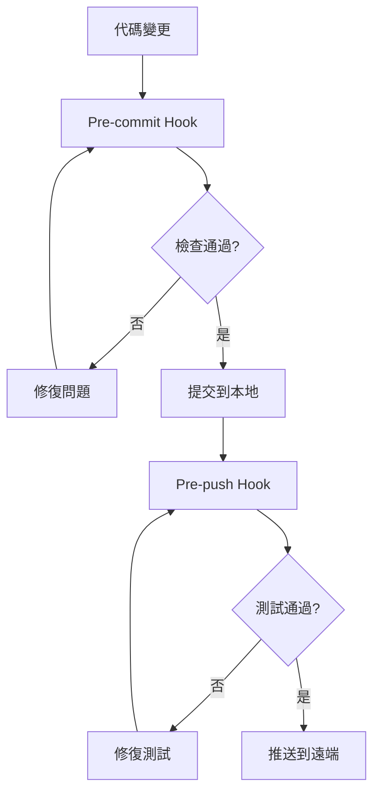
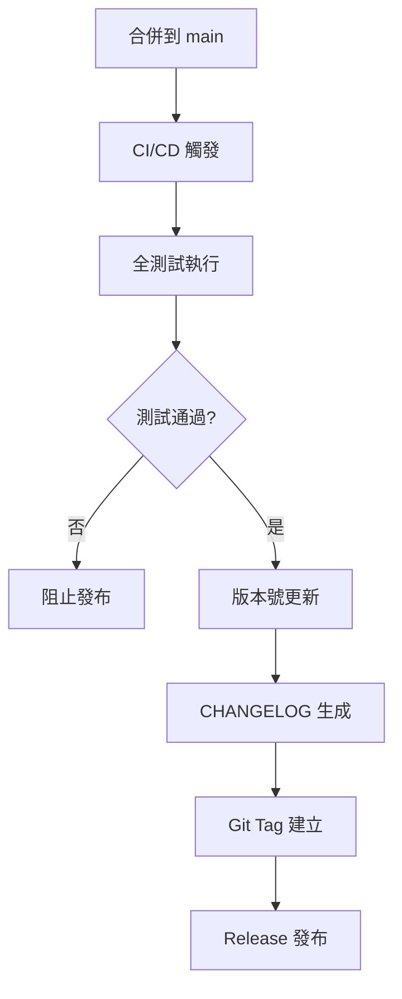
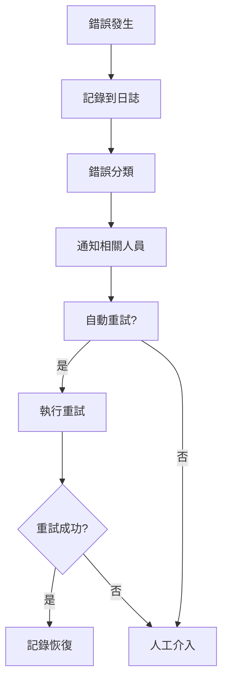

# 驗證規則與最佳實踐

> 基於 Conventional Commits、Semantic Versioning 和現代 DevOps 最佳實踐的企業級驗證框架

## 🎯 核心原則

### 1. 語義版本控制 (Semantic Versioning)
遵循 [SemVer 2.0.0](https://semver.org/) 標準：
- **MAJOR** (X.0.0): 破壞性變更 (`feat!:`, `fix!:`, `BREAKING CHANGE:`)
- **MINOR** (0.X.0): 新功能，向下相容 (`feat:`)
- **PATCH** (0.0.X): 錯誤修復，向下相容 (`fix:`)

### 2. 約定式提交 (Conventional Commits)
遵循 [Conventional Commits 1.0.0](https://www.conventionalcommits.org/) 規範：

```
<type>[optional scope]: <description>

[optional body]

[optional footer(s)]
```

#### 允許的類型 (Types)
- `feat`: 新功能
- `fix`: 錯誤修復
- `docs`: 文檔變更
- `style`: 代碼風格 (不影響功能)
- `refactor`: 重構 (既非新功能也非錯誤修復)
- `perf`: 性能改進
- `test`: 測試相關
- `build`: 建置系統或外部依賴
- `ci`: CI/CD 配置
- `chore`: 其他不修改 src 或 test 的變更
- `revert`: 回滾先前的提交

#### 範圍 (Scopes)
- `core`: 核心功能模組
- `gui`: 圖形使用者介面
- `cli`: 命令列介面
- `db`: 資料庫相關
- `scheduler`: 排程系統
- `executor`: 執行引擎
- `security`: 安全相關
- `test`: 測試框架
- `docs`: 文檔系統
- `deps`: 依賴管理
- `config`: 配置管理
- `ci`: 持續整合
- `release`: 發布相關

### 3. 自動化版本管理工具選擇

#### 主要工具比較
| 工具 | 生態系統 | 自動化程度 | 配置複雜度 | 推薦場景 |
|------|----------|------------|------------|----------|
| **semantic-release** | npm (primary) | 全自動 | 中等 | 完全自動化發布 |
| **standard-version** | npm | 半自動 | 簡單 | 需要人工審核 |
| **conventional-semver-rs** | Rust | 半自動 | 簡單 | Rust 原生專案 |
| **release-plz** | Rust | 全自動 | 中等 | Rust 生態系統 |

#### 本專案選擇：`standard-version` + `conventional-semver-rs`
**理由**：
- 支援 npm + Rust 雙重生態系統
- 保持人工審核控制權
- 配置簡單，維護成本低
- 完整支援 Conventional Commits

## 📋 驗證檢查清單

### 1. 預提交檢查 (Pre-commit)
```bash
# 代碼品質檢查
npm run lint:rust              # Rust Clippy 檢查
npm run format:check           # 代碼格式檢查
npm run test:rust:unit         # Rust 單元測試

# 類型檢查
npm run typecheck              # TypeScript 檢查 (如適用)

# 安全檢查
cargo audit                    # 依賴安全掃描
```

### 2. 預推送檢查 (Pre-push)
```bash
# 完整測試套件
npm run test:all               # 全部測試 (157 Rust + 176 E2E)
npm run test:coverage          # 代碼覆蓋率檢查

# 性能基準測試
npm run bench:all              # 全部性能基準測試

# 建置驗證
npm run cli:build              # CLI 工具建置
npm run tauri build            # GUI 應用建置
```

### 3. 發布前檢查 (Pre-release)
```bash
# 版本一致性檢查
check_version_consistency      # package.json 與 Cargo.toml 同步

# 文檔更新檢查
check_changelog_updated        # CHANGELOG.md 是否更新
check_readme_updated           # README.md 版本號是否正確

# 完整功能驗證
npm run verify:all             # 全功能驗證測試
```

## 🔧 自動化腳本架構

### 1. 驗證主腳本結構
```bash
scripts/
├── validation/
│   ├── pre-commit.sh         # 預提交檢查
│   ├── pre-push.sh           # 預推送檢查
│   ├── version-sync.js       # 版本同步檢查
│   └── test-all.sh           # 全測試執行
├── versioning/
│   ├── bump-version.js       # 版本號更新
│   ├── generate-changelog.js # 更新日誌生成
│   └── release-check.sh      # 發布前檢查
└── logging/
    ├── error-logger.js       # 錯誤日誌系統
    └── test-reporter.js      # 測試結果報告
```

### 2. 錯誤日誌分類
```bash
logs/
├── validation/
│   ├── pre-commit-{timestamp}.log
│   ├── pre-push-{timestamp}.log
│   └── test-results-{timestamp}.log
├── performance/
│   ├── benchmark-{timestamp}.log
│   └── startup-performance-{timestamp}.log
└── errors/
    ├── compilation-errors-{timestamp}.log
    ├── test-failures-{timestamp}.log
    └── runtime-errors-{timestamp}.log
```

## 📊 品質門檻標準

### 1. 代碼覆蓋率要求
- **單元測試覆蓋率**: ≥ 80%
- **整合測試覆蓋率**: ≥ 70%
- **E2E 測試覆蓋率**: ≥ 90% (關鍵用戶流程)
- **總體覆蓋率**: ≥ 75%

### 2. 性能基準要求
- **CLI 啟動時間**: ≤ 100ms (目標: 11.7ms)
- **GUI 啟動時間**: ≤ 3s (目標: <2s)
- **記憶體使用**: ≤ 150MB (目標: <120MB)
- **資料庫查詢**: ≤ 50ms (典型操作)

### 3. 安全要求
- **依賴安全掃描**: 0 個高危漏洞
- **代碼靜態分析**: 0 個安全警告
- **權限檢查**: 完整權限驗證
- **輸入驗證**: 100% 用戶輸入驗證

### 4. 建置要求
- **編譯時間**: ≤ 5 分鐘 (release 建置)
- **執行檔大小**: ≤ 10MB (目標: ~8MB)
- **跨平台支援**: Windows, macOS, Linux
- **依賴相容性**: 無衝突依賴

## 🚀 自動化流程定義

### 1. 開發流程


### 2. 發布流程


### 3. 錯誤處理流程


## 📝 檔案版本管理規範

### 1. 檔案頭部註釋標準
```rust
//! Claude Night Pilot - Core Module
//! 
//! Version: 0.1.1
//! Last Updated: 2025-08-13
//! Author: Claude Night Pilot Team
//! 
//! Description:
//! 核心功能模組，提供 Claude CLI 整合與自動化排程功能
//! 
//! Features:
//! - Claude Code 深度整合
//! - 智慧排程系統
//! - 企業級安全功能
//! 
//! Dependencies:
//! - tokio: 非同步運行時
//! - rusqlite: SQLite 資料庫接口
//! - serde: 序列化框架
```

### 2. 版本同步檢查
確保以下檔案版本號一致：
- `package.json` → `version`
- `src-tauri/Cargo.toml` → `version`
- `README.md` → 版本徽章
- `CHANGELOG.md` → 最新版本記錄

### 3. 自動更新目標
- ✅ **版本號同步**: 自動同步所有配置檔案
- ✅ **更新日誌**: 基於 Conventional Commits 自動生成
- ✅ **Git 標籤**: 自動建立語義版本標籤
- ✅ **Release Notes**: 自動生成發布說明
- ✅ **文檔更新**: 自動更新 README 和 API 文檔

## 🛡️ 安全驗證規則

### 1. 代碼安全
- **靜態分析**: cargo clippy + 安全 lint 規則
- **依賴掃描**: cargo audit 定期檢查
- **祕密檢測**: 防止 API 金鑰等敏感資訊提交
- **權限最小化**: 最小權限原則實施

### 2. 運行時安全
- **輸入驗證**: 所有外部輸入嚴格驗證
- **沙盒執行**: Claude CLI 執行隔離
- **審計日誌**: 完整操作記錄與追蹤
- **錯誤處理**: 安全的錯誤訊息處理

### 3. 資料安全
- **本地儲存**: 敏感資料本地加密
- **傳輸安全**: TLS 加密通訊
- **資料備份**: 自動備份與恢復
- **隱私保護**: 零雲端依賴設計

## 📈 持續改進機制

### 1. 指標監控
- **建置成功率**: 目標 ≥ 95%
- **測試穩定性**: 目標 ≥ 98%
- **性能回歸**: 自動檢測與警報
- **安全漏洞**: 零容忍政策

### 2. 回饋循環
- **定期回顧**: 每週驗證規則回顧
- **工具更新**: 追蹤最新最佳實踐
- **流程優化**: 基於數據的流程改進
- **團隊培訓**: 最佳實踐知識共享

### 3. 自動化擴展
- **新工具評估**: 定期評估新的自動化工具
- **流程標準化**: 可重複的標準化流程
- **錯誤預防**: 從錯誤中學習並預防
- **效率提升**: 持續優化開發體驗

---

**實施優先級**:
1. 🚨 **立即**: 基本驗證腳本和錯誤日誌
2. 📅 **本週**: 版本同步和自動化更新
3. 📅 **下週**: 完整 CI/CD 整合
4. 📅 **本月**: 高級監控和回饋機制

**維護責任**:
- **腳本維護**: 開發團隊
- **規則更新**: 架構師
- **監控告警**: DevOps 團隊
- **安全審計**: 安全團隊