# 🏗️ Claude Night Pilot - 系統架構概覽

> **文件版本**: v2.0.0  
> **最後更新**: 2025-07-23T03:14:08+08:00  
> **負責人**: 系統架構師

## 📋 目錄

1. [系統概述](#系統概述)
2. [架構設計原則](#架構設計原則)
3. [系統架構圖](#系統架構圖)
4. [技術棧架構](#技術棧架構)
5. [資料流設計](#資料流設計)
6. [模組設計](#模組設計)
7. [部署架構](#部署架構)

---

## 🎯 系統概述

### 專案定位

Claude Night Pilot 是一個現代化的 Claude CLI 自動化工具，專為需要大量使用 Claude 的開發者和創作者設計。系統採用 **極簡架構** 與 **高效能設計**，確保在提供強大功能的同時保持輕量化。

### 核心架構特性

| 特性         | 說明             | 技術實現             |
| ------------ | ---------------- | -------------------- |
| **單體應用** | 避免微服務複雜性 | Tauri 2.0 單一二進位 |
| **本地優先** | 零雲端依賴       | SQLite + 本地存儲    |
| **跨平台**   | 支援主流作業系統 | Rust + WebView       |
| **輕量化**   | 極小資源占用     | < 10MB 檔案大小      |

---

## 🎨 架構設計原則

### SOLID 原則應用

#### 1. 單一職責原則 (SRP)

```rust
// ✅ 每個模組只負責一項核心功能
pub mod prompt_manager;    // 只處理 Prompt CRUD
pub mod claude_executor;   // 只處理 Claude CLI 執行
pub mod scheduler;         // 只處理排程管理
pub mod database;          // 只處理資料持久化
```

#### 2. 開放封閉原則 (OCP)

```rust
// ✅ 透過 trait 實現擴展性
pub trait ExecutorInterface {
    async fn execute(&self, prompt: &str) -> Result<String>;
}

pub struct ClaudeExecutor;
pub struct MockExecutor;  // 測試用實作

impl ExecutorInterface for ClaudeExecutor { /* ... */ }
impl ExecutorInterface for MockExecutor { /* ... */ }
```

### DRY 原則 (Don't Repeat Yourself)

```rust
// ✅ 共享組件設計
pub mod common {
    pub mod error_handling;
    pub mod validation;
    pub mod logging;
    pub mod config;
}
```

### KISS 原則 (Keep It Simple, Stupid)

- **前端**: 純 HTML + htmx，避免複雜 SPA 框架
- **狀態管理**: 直接使用 Tauri IPC，無需複雜狀態庫
- **資料庫**: SQLite 單檔，無需複雜 ORM

---

## 🏛️ 系統架構圖

### 高層架構視圖

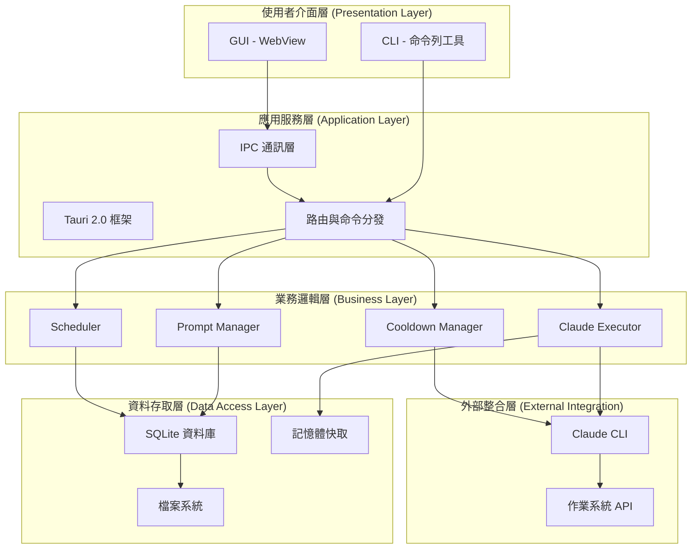

### 資料流程圖

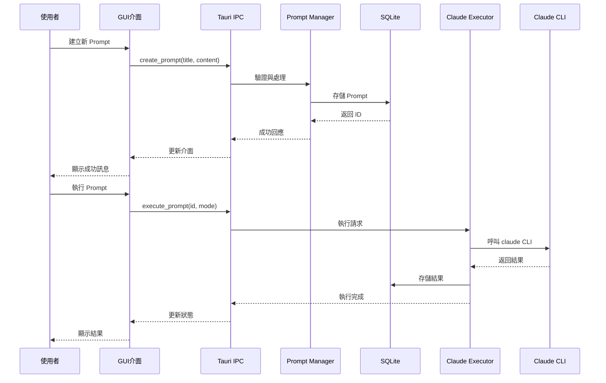

---

## 🛠️ 技術棧架構

### 分層技術選擇

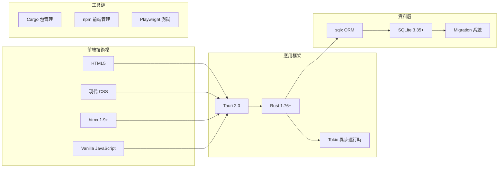

### 依賴關係圖

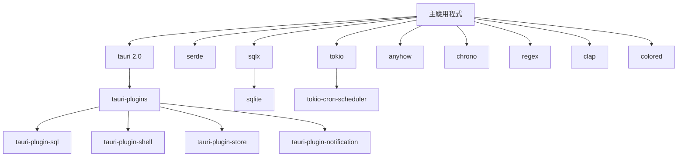

---

## 📊 資料流設計

### 資料庫架構

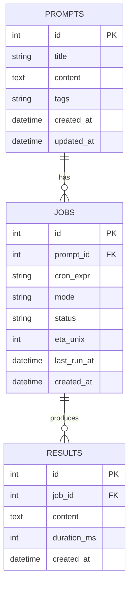

### 狀態管理

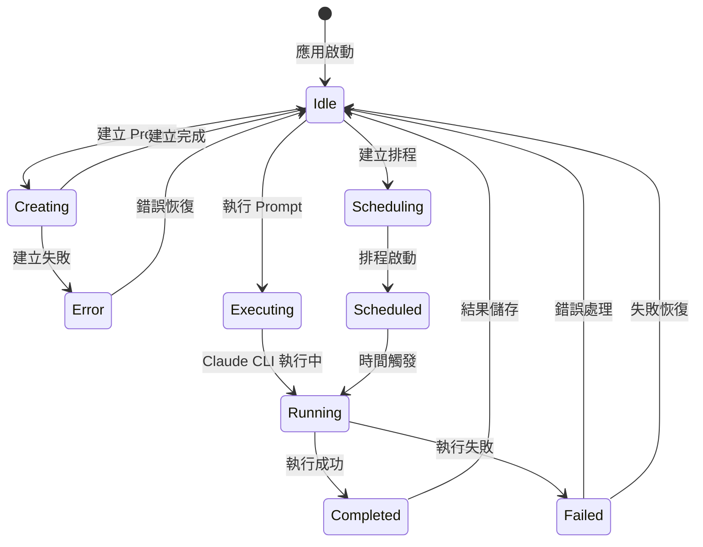

---

## 🧩 模組設計

### 核心模組架構

#### 1. Prompt Manager 模組

```rust
// src/prompt_manager.rs
pub struct PromptManager {
    db_pool: SqlitePool,
}

impl PromptManager {
    // CRUD 操作
    pub async fn create(&self, prompt: CreatePromptRequest) -> Result<i64>;
    pub async fn list(&self) -> Result<Vec<Prompt>>;
    pub async fn get(&self, id: i64) -> Result<Option<Prompt>>;
    pub async fn update(&self, id: i64, prompt: UpdatePromptRequest) -> Result<()>;
    pub async fn delete(&self, id: i64) -> Result<()>;

    // 搜尋與過濾
    pub async fn search(&self, query: &str) -> Result<Vec<Prompt>>;
    pub async fn filter_by_tags(&self, tags: &[String]) -> Result<Vec<Prompt>>;
}
```

#### 2. Claude Executor 模組

```rust
// src/claude_executor.rs
pub struct ClaudeExecutor {
    cooldown_manager: Arc<CooldownManager>,
}

impl ClaudeExecutor {
    pub async fn execute(&self, prompt: &str) -> Result<ExecutionResult>;
    pub async fn execute_with_timeout(&self, prompt: &str, timeout: Duration) -> Result<ExecutionResult>;

    // Claude Code 語法支援
    pub async fn execute_with_files(&self, prompt: &str, files: &[PathBuf]) -> Result<ExecutionResult>;
    pub async fn execute_with_context(&self, prompt: &str, context: &ExecutionContext) -> Result<ExecutionResult>;
}
```

#### 3. Scheduler 模組

```rust
// src/scheduler.rs
pub struct Scheduler {
    job_scheduler: JobScheduler,
    db_pool: SqlitePool,
    executor: Arc<ClaudeExecutor>,
}

impl Scheduler {
    pub async fn create_job(&self, job: CreateJobRequest) -> Result<i64>;
    pub async fn pause_job(&self, job_id: i64) -> Result<()>;
    pub async fn resume_job(&self, job_id: i64) -> Result<()>;
    pub async fn delete_job(&self, job_id: i64) -> Result<()>;
    pub async fn list_jobs(&self) -> Result<Vec<Job>>;
}
```

### 模組間通訊設計

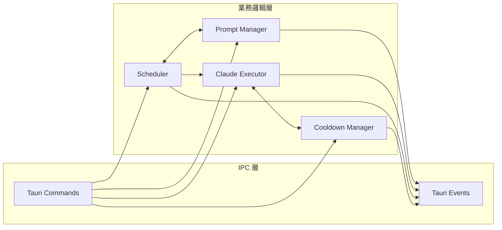

---

## 🚀 部署架構

### 建置流程架構

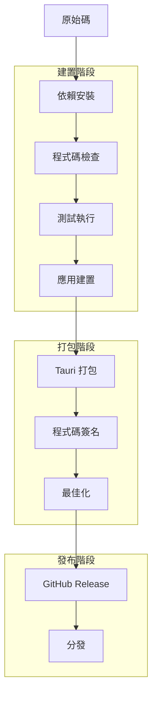

### 跨平台部署

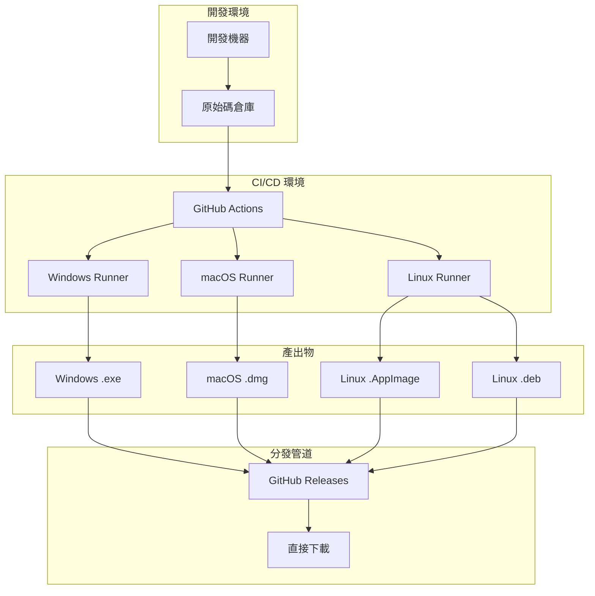

---

## 📈 效能架構

### 效能設計策略

| 層級       | 最佳化策略 | 實施方式                 |
| ---------- | ---------- | ------------------------ |
| **應用層** | 啟動最佳化 | Lazy loading、漸進式載入 |
| **資料層** | 查詢最佳化 | 索引設計、預編譯語句     |
| **記憶體** | 記憶體管理 | 物件池、及時釋放         |
| **I/O**    | 非同步處理 | Tokio 異步運行時         |
| **UI**     | 渲染最佳化 | 虛擬化、防抖動           |

### 快取架構

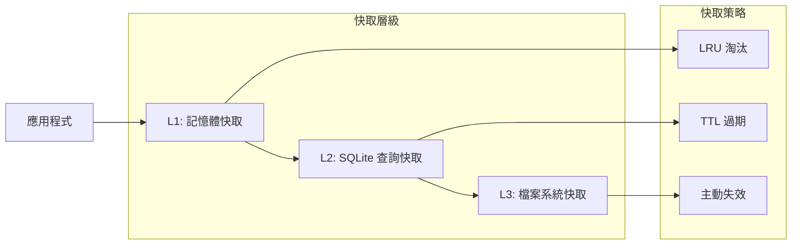

---

## 🔒 安全架構

### 安全設計原則

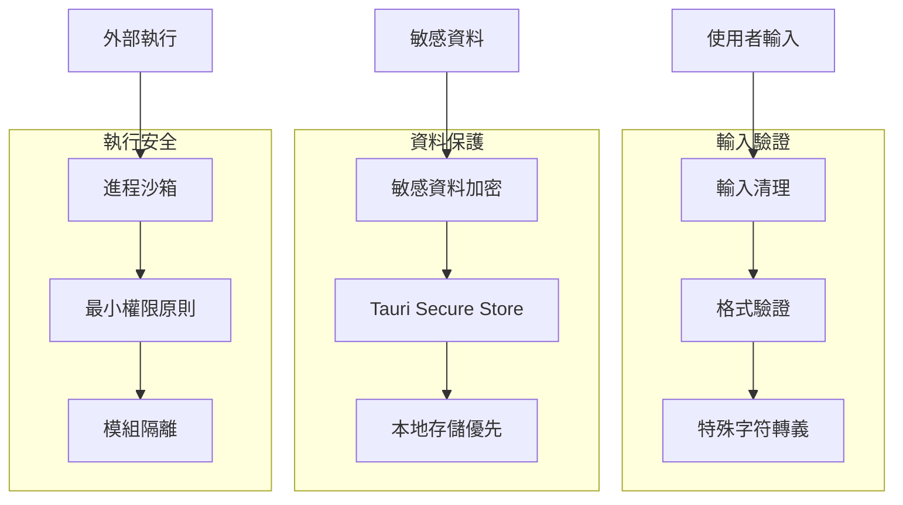

---

## 📚 參考資料

### 架構決策記錄 (ADR)

1. [ADR-001: 選擇 Tauri 作為桌面應用框架](../decisions/ADR-001-tauri-framework.md)
2. [ADR-002: 採用 SQLite 作為資料庫](../decisions/ADR-002-sqlite-database.md)
3. [ADR-003: 使用 htmx 進行前端互動](../decisions/ADR-003-htmx-frontend.md)

### 相關文檔

- [資料庫設計](database-schema.md)
- [API 設計](api-design.md)
- [安全性設計](security-design.md)
- [效能基準](performance-benchmarks.md)

---

**文檔維護者**: 系統架構師  
**審查頻率**: 每季度  
**下次審查**: 2025-10-23
