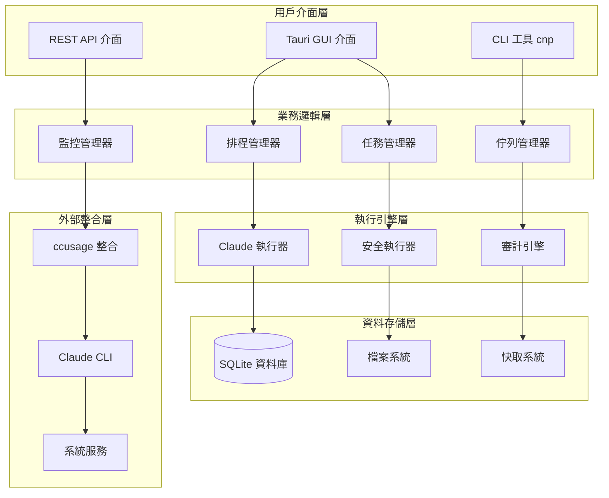

# Claude Night Pilot 整合架構報告

## 執行摘要

本報告基於對四個研究專案的深度分析，為 Claude Night Pilot 設計一套完整的整合架構。該架構將結合各專案的核心優勢，建構一個統一、安全、可擴展的 Claude 自動化平台。

## 整合架構設計

### 1. 核心架構層次



### 2. 模組化設計原則

#### 2.1 單一責任原則
每個模組專注於特定功能領域：
- **監控模組**: 專門處理使用狀況監控
- **執行模組**: 專門處理 Claude 命令執行
- **安全模組**: 專門處理安全驗證和審計
- **排程模組**: 專門處理任務排程和時間管理

#### 2.2 開放封閉原則
系統對擴展開放，對修改封閉：
- 插件式任務處理器
- 可插拔的監控後端
- 擴展性執行選項

#### 2.3 依賴倒置原則
高層模組不依賴低層模組：
- 抽象介面定義
- 依賴注入模式
- 配置驅動的組件選擇

## 核心模組設計

### 1. 增強型監控系統 (`src-tauri/src/monitor.rs`)

```rust
// 整合 ccusage 和自定義監控邏輯
pub struct EnhancedMonitor {
    ccusage_integration: CcusageIntegration,
    fallback_timer: TimeBasedMonitor,
    usage_tracker: UsageTracker,
}

impl EnhancedMonitor {
    pub async fn get_usage_info(&self) -> Result<UsageInfo> {
        // 1. 嘗試 ccusage 獲取精確資訊
        if let Ok(info) = self.ccusage_integration.get_blocks_info().await {
            return Ok(self.enhance_with_predictions(info));
        }
        
        // 2. 回退到時間計算
        let fallback_info = self.fallback_timer.estimate_usage().await?;
        Ok(fallback_info)
    }
    
    pub async fn get_adaptive_check_interval(&self, remaining_minutes: u64) -> Duration {
        match remaining_minutes {
            0..=2 => Duration::from_secs(30),     // 緊急模式
            3..=10 => Duration::from_secs(60),    // 頻繁模式  
            11..=30 => Duration::from_secs(300),  // 正常模式
            _ => Duration::from_secs(600),        // 休眠模式
        }
    }
}

#[derive(Debug, Serialize, Deserialize)]
pub struct UsageInfo {
    pub current_block: Option<UsageBlock>,
    pub time_remaining_minutes: u64,
    pub next_reset_time: DateTime<Utc>,
    pub usage_rate: f64,                    // tokens per minute
    pub cost_projection: f64,               // projected cost
    pub confidence_level: f32,              // 0.0-1.0
}
```

### 2. 統一任務管理系統 (`src-tauri/src/task_manager.rs`)

```rust
// 整合多種任務類型的統一管理器
pub struct UnifiedTaskManager {
    simple_renewal: SimpleRenewalHandler,
    queue_processor: QueueProcessor,
    file_based_tasks: FileBasedTaskHandler,
    scheduler: CronScheduler,
}

#[derive(Debug, Clone, Serialize, Deserialize)]
pub enum TaskType {
    SimpleRenewal {
        message: String,
    },
    QueuedTask {
        queue_id: String,
        priority: TaskPriority,
    },
    FileBasedTask {
        task_file: PathBuf,
        rules_file: Option<PathBuf>,
    },
    ScheduledTask {
        cron_expression: String,
        task_definition: Box<TaskType>,
    },
}

#[derive(Debug, Clone, Serialize, Deserialize)]
pub struct TaskDefinition {
    pub id: String,
    pub name: String,
    pub task_type: TaskType,
    pub execution_options: ExecutionOptions,
    pub safety_rules: Vec<SafetyRule>,
    pub retry_policy: RetryPolicy,
    pub created_at: DateTime<Utc>,
    pub status: TaskStatus,
}

impl UnifiedTaskManager {
    pub async fn execute_task(&self, task: &TaskDefinition) -> Result<TaskExecutionResult> {
        // 1. 安全性預檢
        self.validate_task_safety(task).await?;
        
        // 2. 根據任務類型選擇處理器
        let result = match &task.task_type {
            TaskType::SimpleRenewal { message } => {
                self.simple_renewal.execute(message, &task.execution_options).await
            },
            TaskType::QueuedTask { queue_id, priority } => {
                self.queue_processor.process_queue_item(queue_id, *priority).await
            },
            TaskType::FileBasedTask { task_file, rules_file } => {
                self.file_based_tasks.execute_from_files(task_file, rules_file.as_ref()).await
            },
            TaskType::ScheduledTask { cron_expression, task_definition } => {
                self.scheduler.execute_scheduled_task(cron_expression, task_definition).await
            },
        };
        
        // 3. 結果審計和記錄
        self.audit_execution_result(&result, task).await?;
        
        Ok(result)
    }
}
```

### 3. 增強型安全執行器 (`src-tauri/src/secure_executor.rs`)

```rust
// 基於現有 ExecutionOptions 的增強版本
#[derive(Debug, Clone, Serialize, Deserialize)]
pub struct EnhancedExecutionOptions {
    // 基礎選項 (來自原 ExecutionOptions)
    pub skip_permissions: bool,
    pub output_format: String,
    pub timeout_seconds: Option<u64>,
    pub dry_run: bool,
    pub max_retries: u32,
    
    // 新增安全選項
    pub sandbox_enabled: bool,
    pub allowed_file_patterns: Vec<String>,
    pub blocked_file_patterns: Vec<String>,
    pub allowed_commands: Vec<String>,
    pub resource_limits: ResourceLimits,
    pub audit_level: AuditLevel,
    
    // 新增監控選項  
    pub progress_callback: Option<String>,
    pub heartbeat_interval: Option<Duration>,
    pub auto_pause_on_error: bool,
}

#[derive(Debug, Clone, Serialize, Deserialize)]
pub struct ResourceLimits {
    pub max_execution_time: Duration,
    pub max_memory_mb: u64,
    pub max_file_operations: u32,
    pub max_network_requests: u32,
}

impl SecureExecutor {
    pub async fn execute_with_enhanced_security(
        &self,
        prompt: &str,
        options: &EnhancedExecutionOptions,
    ) -> Result<ExecutionResult> {
        // 1. 多層安全檢查
        let security_context = self.create_security_context(options).await?;
        self.validate_prompt_safety(prompt, &security_context).await?;
        
        // 2. 沙盒環境設置
        let sandbox = if options.sandbox_enabled {
            Some(self.create_sandbox(&options.allowed_file_patterns).await?)
        } else {
            None
        };
        
        // 3. 資源監控設置
        let resource_monitor = ResourceMonitor::new(&options.resource_limits);
        
        // 4. 執行監控和控制
        let execution_context = ExecutionContext {
            security_context,
            sandbox,
            resource_monitor,
            audit_logger: self.create_audit_logger(options.audit_level),
        };
        
        self.execute_with_context(prompt, options, execution_context).await
    }
}
```

### 4. ccusage 深度整合 (`src-tauri/src/ccusage_integration.rs`)

```rust
// 基於 ccusage 研究的深度整合實現
pub struct CcusageIntegration {
    command_finder: CcusageCommandFinder,
    data_parser: CcusageDataParser,
    cache: LruCache<String, CcusageData>,
}

impl CcusageIntegration {
    pub async fn get_current_usage_blocks(&self) -> Result<Vec<UsageBlock>> {
        let cmd = self.command_finder.find_ccusage_command().await?;
        
        // 嘗試多種 ccusage 命令獲取最佳資料
        let strategies = vec![
            format!("{} blocks --live --json", cmd),
            format!("{} blocks --json", cmd),
            format!("{} blocks", cmd),
        ];
        
        for strategy in strategies {
            if let Ok(output) = self.execute_ccusage_command(&strategy).await {
                if let Ok(blocks) = self.data_parser.parse_blocks_output(&output) {
                    return Ok(blocks);
                }
            }
        }
        
        Err(anyhow::anyhow!("無法獲取 ccusage 資料"))
    }
    
    pub async fn get_detailed_session_info(&self) -> Result<SessionInfo> {
        let cmd = self.command_finder.find_ccusage_command().await?;
        let output = self.execute_ccusage_command(&format!("{} session --json", cmd)).await?;
        
        self.data_parser.parse_session_output(&output)
    }
    
    pub async fn monitor_usage_real_time(&self) -> Result<impl Stream<Item = UsageUpdate>> {
        let cmd = self.command_finder.find_ccusage_command().await?;
        
        // 建立即時監控流
        let stream = self.create_monitoring_stream(&cmd).await?;
        Ok(stream.map(|data| self.convert_to_usage_update(data)))
    }
}

#[derive(Debug, Clone, Serialize, Deserialize)]
pub struct CcusageCommandFinder {
    preference_order: Vec<String>,
}

impl CcusageCommandFinder {
    pub async fn find_ccusage_command(&self) -> Result<String> {
        for cmd in &self.preference_order {
            if self.test_command_availability(cmd).await? {
                return Ok(cmd.clone());
            }
        }
        Err(anyhow::anyhow!("ccusage 不可用"))
    }
    
    fn default() -> Self {
        Self {
            preference_order: vec![
                "ccusage".to_string(),
                "bunx ccusage".to_string(),
                "npx ccusage@latest".to_string(),
            ],
        }
    }
}
```

## 資料庫擴展設計

### 1. 擴展現有資料庫結構

```sql
-- 基於現有 SQLite 結構的擴展

-- 增強型 prompts 表
ALTER TABLE prompts ADD COLUMN prompt_type TEXT DEFAULT 'simple';
ALTER TABLE prompts ADD COLUMN template_variables TEXT; -- JSON
ALTER TABLE prompts ADD COLUMN safety_rules TEXT; -- JSON
ALTER TABLE prompts ADD COLUMN execution_options TEXT; -- JSON

-- 新增 usage_monitoring 表
CREATE TABLE usage_monitoring (
    id INTEGER PRIMARY KEY AUTOINCREMENT,
    timestamp DATETIME DEFAULT CURRENT_TIMESTAMP,
    block_start_time DATETIME,
    block_end_time DATETIME,
    tokens_used INTEGER,
    tokens_remaining INTEGER,
    cost_usd REAL,
    data_source TEXT, -- 'ccusage', 'estimated', 'manual'
    confidence_level REAL,
    raw_data TEXT -- JSON
);

-- 新增 task_templates 表
CREATE TABLE task_templates (
    id INTEGER PRIMARY KEY AUTOINCREMENT,
    name TEXT NOT NULL,
    description TEXT,
    task_type TEXT NOT NULL, -- 'simple', 'queued', 'file_based', 'scheduled'
    template_content TEXT NOT NULL, -- JSON
    safety_rules TEXT, -- JSON
    default_options TEXT, -- JSON
    created_at DATETIME DEFAULT CURRENT_TIMESTAMP,
    updated_at DATETIME DEFAULT CURRENT_TIMESTAMP
);

-- 新增 execution_audit 表
CREATE TABLE execution_audit (
    id INTEGER PRIMARY KEY AUTOINCREMENT,
    task_id INTEGER,
    execution_id TEXT UNIQUE,
    prompt_hash TEXT,
    execution_options TEXT, -- JSON
    security_check_result TEXT, -- JSON
    execution_start DATETIME,
    execution_end DATETIME,
    execution_result TEXT, -- 'success', 'failed', 'cancelled', 'timeout', 'security_blocked'
    output_length INTEGER,
    error_message TEXT,
    audit_data TEXT, -- JSON
    created_at DATETIME DEFAULT CURRENT_TIMESTAMP,
    FOREIGN KEY (task_id) REFERENCES prompts(id) ON DELETE CASCADE
);

-- 新增 system_config 表
CREATE TABLE system_config (
    key TEXT PRIMARY KEY,
    value TEXT,
    value_type TEXT, -- 'string', 'number', 'boolean', 'json'
    description TEXT,
    updated_at DATETIME DEFAULT CURRENT_TIMESTAMP
);
```

### 2. 資料存取層設計

```rust
// 擴展現有 Database 結構
impl Database {
    // 使用監控相關方法
    pub async fn save_usage_monitoring(&self, data: &UsageMonitoringData) -> Result<i64> {
        let result = sqlx::query!(
            r#"
            INSERT INTO usage_monitoring 
            (block_start_time, block_end_time, tokens_used, tokens_remaining, 
             cost_usd, data_source, confidence_level, raw_data)
            VALUES (?, ?, ?, ?, ?, ?, ?, ?)
            "#,
            data.block_start_time,
            data.block_end_time,
            data.tokens_used,
            data.tokens_remaining,
            data.cost_usd,
            data.data_source,
            data.confidence_level,
            data.raw_data
        )
        .execute(&self.pool)
        .await?;
        
        Ok(result.last_insert_rowid())
    }
    
    pub async fn get_recent_usage_data(&self, hours: u32) -> Result<Vec<UsageMonitoringData>> {
        let cutoff = Utc::now() - chrono::Duration::hours(hours as i64);
        
        let records = sqlx::query_as!(
            UsageMonitoringData,
            r#"
            SELECT * FROM usage_monitoring 
            WHERE timestamp >= ? 
            ORDER BY timestamp DESC
            "#,
            cutoff
        )
        .fetch_all(&self.pool)
        .await?;
        
        Ok(records)
    }
    
    // 任務模板管理
    pub async fn create_task_template(&self, template: &TaskTemplate) -> Result<i64> {
        let result = sqlx::query!(
            r#"
            INSERT INTO task_templates 
            (name, description, task_type, template_content, safety_rules, default_options)
            VALUES (?, ?, ?, ?, ?, ?)
            "#,
            template.name,
            template.description,
            template.task_type,
            serde_json::to_string(&template.template_content)?,
            serde_json::to_string(&template.safety_rules)?,
            serde_json::to_string(&template.default_options)?
        )
        .execute(&self.pool)
        .await?;
        
        Ok(result.last_insert_rowid())
    }
    
    // 執行審計
    pub async fn save_execution_audit(&self, audit: &ExecutionAudit) -> Result<i64> {
        let result = sqlx::query!(
            r#"
            INSERT INTO execution_audit 
            (task_id, execution_id, prompt_hash, execution_options, 
             security_check_result, execution_start, execution_end, 
             execution_result, output_length, error_message, audit_data)
            VALUES (?, ?, ?, ?, ?, ?, ?, ?, ?, ?, ?)
            "#,
            audit.task_id,
            audit.execution_id,
            audit.prompt_hash,
            serde_json::to_string(&audit.execution_options)?,
            serde_json::to_string(&audit.security_check_result)?,
            audit.execution_start,
            audit.execution_end,
            audit.execution_result.to_string(),
            audit.output_length,
            audit.error_message,
            serde_json::to_string(&audit.audit_data)?
        )
        .execute(&self.pool)
        .await?;
        
        Ok(result.last_insert_rowid())
    }
}
```

## 整合策略與實施計劃

### 階段 1: 基礎整合 (2-3 週)

#### 1.1 ccusage 整合
- 實現 `CcusageIntegration` 模組
- 整合到現有 `get_cooldown_status` 命令
- 添加回退機制以確保相容性

#### 1.2 增強型執行器
- 擴展現有 `ExecutionOptions` 結構
- 實現基礎安全檢查功能
- 整合到現有 `ClaudeExecutor`

#### 1.3 資料庫擴展
- 執行資料庫遷移腳本
- 更新現有資料存取方法
- 實現新資料模型的 CRUD 操作

### 階段 2: 進階功能 (3-4 週)

#### 2.1 統一任務管理
- 實現 `UnifiedTaskManager`
- 整合多種任務類型支援
- 建立任務範本系統

#### 2.2 智能監控系統
- 實現自適應監控頻率
- 建立使用預測模型
- 整合即時監控流

#### 2.3 GUI 更新
- 更新 Tauri 前端以支援新功能
- 實現即時監控儀表板
- 添加任務管理介面

### 階段 3: 企業功能 (4-5 週)

#### 3.1 高級安全功能
- 實現沙盒執行環境
- 建立細緻的權限控制
- 實現審計日誌系統

#### 3.2 性能優化
- 實現智能快取系統
- 優化資料庫查詢
- 實現並行任務處理

#### 3.3 可擴展性
- 實現插件系統
- 建立 API 介面
- 實現叢集部署支援

## 風險管理與緩解策略

### 技術風險

#### 1. ccusage 依賴性風險
- **風險**: ccusage 工具不可用或資料格式變更
- **緩解**: 實現強健的回退機制，維護本地時間計算邏輯

#### 2. Claude CLI API 變更風險
- **風險**: Claude CLI 命令或參數變更導致整合失效
- **緩解**: 實現版本檢測和相容性層，維護多版本支援

#### 3. 性能風險
- **風險**: 頻繁監控導致系統資源消耗過高
- **緩解**: 實現智能監控頻率調整，使用高效快取策略

### 安全風險

#### 1. 權限跳過風險
- **風險**: `--dangerously-skip-permissions` 可能導致意外操作
- **緩解**: 實現多層安全檢查，沙盒執行環境，詳細審計記錄

#### 2. 程式碼注入風險
- **風險**: 用戶輸入可能包含惡意程式碼
- **緩解**: 嚴格輸入驗證，參數轉義，白名單機制

#### 3. 資料洩露風險
- **風險**: 執行日誌可能包含敏感資訊
- **緩解**: 實現敏感資料偵測和過濾，加密存儲敏感日誌

## 測試策略

### 單元測試
- 每個新模組需達到 90% 程式碼覆蓋率
- Mock 外部依賴 (ccusage, Claude CLI)
- 測試錯誤處理和邊界條件

### 整合測試  
- 測試 ccusage 整合的各種場景
- 測試不同任務類型的執行流程
- 測試安全檢查和審計功能

### 端到端測試
- 模擬完整的使用者工作流程
- 測試 GUI 和 CLI 介面
- 測試長時間運行和恢復場景

### 性能測試
- 測試高頻監控的性能影響
- 測試並行任務執行的資源使用
- 測試大資料量下的查詢性能

## 結論

本整合架構設計提供了一個全面、安全、可擴展的解決方案，將四個研究專案的核心優勢整合到 Claude Night Pilot 中。通過分階段實施策略，可以在保持系統穩定性的同時，循序漸進地引入新功能。

關鍵成功因素：
1. **模組化設計**: 確保系統各部分可以獨立開發和測試
2. **向後相容**: 保持現有功能不受影響
3. **安全優先**: 在每個層面都考慮安全性
4. **性能意識**: 避免過度監控影響系統性能
5. **用戶體驗**: 保持簡潔直觀的介面設計

通過執行此整合計劃，Claude Night Pilot 將成為一個功能強大、安全可靠的 Claude 自動化平台，滿足從個人開發者到企業用戶的各種需求。