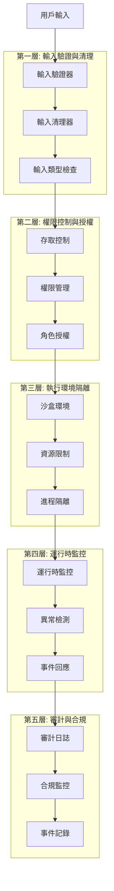

# Claude Night Pilot 安全實施報告

## 執行摘要

基於對研究專案的安全風險分析，本報告為 Claude Night Pilot 設計了一套全面的安全實施框架。該框架將解決 `--dangerously-skip-permissions` 使用、程式碼注入防護、資料隱私保護等關鍵安全議題。

## 安全威脅模型分析

### 1. 威脅分類與風險評估

#### 1.1 高風險威脅 (Critical)

**T1: 未授權的系統操作**
- **威脅描述**: 透過 `--dangerously-skip-permissions` 執行惡意系統命令
- **影響範圍**: 整個系統的檔案系統、進程、網路存取
- **攻擊向量**: 惡意 prompt 注入、任務檔案篡改
- **風險評分**: 9.5/10

**T2: 程式碼/命令注入攻擊**
- **威脅描述**: 在 prompt 或任務定義中注入惡意程式碼
- **影響範圍**: Claude CLI 執行環境、本地檔案系統
- **攻擊向量**: 用戶輸入、檔案系統攻擊、網路注入
- **風險評分**: 9.2/10

**T3: 敏感資料洩露**
- **威脅描述**: 執行日誌、審計記錄中包含機密資訊
- **影響範圍**: API 金鑰、個人資料、商業機密
- **攻擊向量**: 日誌檔案存取、資料庫洩露、記憶體轉儲
- **風險評分**: 8.8/10

#### 1.2 中風險威脅 (High)

**T4: 權限擴展攻擊**
- **威脅描述**: 利用應用權限執行超出預期範圍的操作
- **影響範圍**: 系統配置、其他應用程式
- **攻擊向量**: 權限濫用、API 誤用
- **風險評分**: 7.5/10

**T5: 資源耗盡攻擊**
- **威脅描述**: 惡意任務消耗過多系統資源
- **影響範圍**: 系統性能、其他應用程式可用性
- **攻擊向量**: 無限循環、記憶體洩漏、大量檔案操作
- **風險評分**: 7.0/10

#### 1.3 低風險威脅 (Medium)

**T6: 配置篡改**
- **威脅描述**: 未授權修改系統配置
- **影響範圍**: 應用程式行為、安全設定
- **攻擊向量**: 檔案系統存取、API 濫用
- **風險評分**: 5.5/10

## 安全架構設計

### 1. 多層防禦架構



### 2. 核心安全模組實現

#### 2.1 安全執行器 (`src-tauri/src/security/secure_executor.rs`)

```rust
use anyhow::Result;
use serde::{Deserialize, Serialize};
use std::collections::HashSet;
use std::path::PathBuf;
use std::process::Command;
use std::time::Duration;
use tokio::sync::RwLock;

/// 安全執行器 - 提供多層安全檢查的 Claude 執行環境
pub struct SecureExecutor {
    security_config: SecurityConfig,
    sandbox_manager: SandboxManager,
    audit_logger: AuditLogger,
    permission_checker: PermissionChecker,
}

#[derive(Debug, Clone, Serialize, Deserialize)]
pub struct SecurityConfig {
    /// 是否啟用沙盒模式
    pub sandbox_enabled: bool,
    /// 允許的檔案路徑模式
    pub allowed_paths: Vec<String>,
    /// 禁止的檔案路徑模式
    pub blocked_paths: Vec<String>,
    /// 允許的命令列表
    pub allowed_commands: HashSet<String>,
    /// 禁止的關鍵詞列表
    pub blocked_keywords: Vec<String>,
    /// 資源限制配置
    pub resource_limits: ResourceLimits,
    /// 審計級別
    pub audit_level: AuditLevel,
}

#[derive(Debug, Clone, Serialize, Deserialize)]
pub struct ResourceLimits {
    /// 最大執行時間（秒）
    pub max_execution_time: u64,
    /// 最大記憶體使用（MB）
    pub max_memory_mb: u64,
    /// 最大檔案操作數
    pub max_file_operations: u32,
    /// 最大網路請求數
    pub max_network_requests: u32,
    /// 最大輸出長度（字元）
    pub max_output_length: usize,
}

#[derive(Debug, Clone, Serialize, Deserialize)]
pub enum AuditLevel {
    None,       // 無審計
    Basic,      // 基本審計（成功/失敗）
    Detailed,   // 詳細審計（包含 prompt）
    Full,       // 完整審計（包含完整輸出）
}

impl SecureExecutor {
    pub fn new(config: SecurityConfig) -> Self {
        Self {
            sandbox_manager: SandboxManager::new(&config),
            audit_logger: AuditLogger::new(config.audit_level.clone()),
            permission_checker: PermissionChecker::new(&config),
            security_config: config,
        }
    }
    
    /// 安全執行 Claude 命令
    pub async fn execute_secure(
        &self,
        prompt: &str,
        options: &EnhancedExecutionOptions,
    ) -> Result<SecureExecutionResult> {
        let execution_id = self.generate_execution_id();
        
        // 階段 1: 輸入驗證與清理
        let sanitized_prompt = self.validate_and_sanitize_input(prompt).await?;
        
        // 階段 2: 權限檢查
        self.permission_checker.validate_execution_permission(options).await?;
        
        // 階段 3: 安全評估
        let security_assessment = self.assess_security_risk(&sanitized_prompt, options).await?;
        
        if security_assessment.risk_level > RiskLevel::Medium && !options.force_execution {
            return Err(anyhow::anyhow!(
                "安全風險過高，拒絕執行: {:?}", 
                security_assessment.risk_factors
            ));
        }
        
        // 階段 4: 沙盒環境準備
        let sandbox_context = if self.security_config.sandbox_enabled {
            Some(self.sandbox_manager.create_sandbox(&execution_id).await?)
        } else {
            None
        };
        
        // 階段 5: 執行監控
        let execution_monitor = ExecutionMonitor::new(
            &execution_id,
            &self.security_config.resource_limits,
        );
        
        // 階段 6: 實際執行
        let start_time = std::time::Instant::now();
        
        let result = tokio::select! {
            result = self.execute_with_monitoring(
                &sanitized_prompt, 
                options, 
                &sandbox_context,
                &execution_monitor
            ) => result,
            _ = tokio::time::sleep(Duration::from_secs(
                self.security_config.resource_limits.max_execution_time
            )) => {
                Err(anyhow::anyhow!("執行超時"))
            }
        };
        
        let execution_time = start_time.elapsed();
        
        // 階段 7: 清理沙盒
        if let Some(sandbox) = sandbox_context {
            self.sandbox_manager.cleanup_sandbox(sandbox).await?;
        }
        
        // 階段 8: 審計記錄
        let audit_record = AuditRecord {
            execution_id: execution_id.clone(),
            prompt_hash: self.calculate_hash(&sanitized_prompt),
            security_assessment: security_assessment.clone(),
            execution_time,
            result: result.as_ref().map(|r| r.status.clone()).unwrap_or_else(|e| {
                ExecutionStatus::Failed(e.to_string())
            }),
            resource_usage: execution_monitor.get_final_usage().await,
        };
        
        self.audit_logger.log_execution(&audit_record).await?;
        
        // 階段 9: 結果處理
        match result {
            Ok(mut exec_result) => {
                // 清理輸出中的敏感資訊
                exec_result.output = self.sanitize_output(&exec_result.output).await?;
                
                Ok(SecureExecutionResult {
                    execution_id,
                    result: exec_result,
                    security_assessment,
                    audit_record_id: audit_record.id.clone(),
                })
            }
            Err(e) => Err(e),
        }
    }
}
```

#### 2.2 輸入驗證與清理 (`src-tauri/src/security/input_validator.rs`)

```rust
/// 輸入驗證器 - 檢查和清理用戶輸入
pub struct InputValidator {
    dangerous_patterns: Vec<regex::Regex>,
    sensitive_data_patterns: Vec<regex::Regex>,
    command_injection_patterns: Vec<regex::Regex>,
}

impl InputValidator {
    pub fn new() -> Result<Self> {
        Ok(Self {
            dangerous_patterns: Self::compile_dangerous_patterns()?,
            sensitive_data_patterns: Self::compile_sensitive_patterns()?,
            command_injection_patterns: Self::compile_injection_patterns()?,
        })
    }
    
    /// 驗證並清理輸入
    pub async fn validate_and_sanitize(&self, input: &str) -> Result<String> {
        // 1. 檢查危險模式
        self.check_dangerous_patterns(input)?;
        
        // 2. 檢查命令注入
        self.check_command_injection(input)?;
        
        // 3. 檢查敏感資料
        self.check_sensitive_data(input)?;
        
        // 4. 清理輸入
        let sanitized = self.sanitize_input(input).await?;
        
        Ok(sanitized)
    }
    
    fn compile_dangerous_patterns() -> Result<Vec<regex::Regex>> {
        let patterns = vec![
            // 系統命令
            r"(?i)\b(rm\s+-rf|sudo\s+rm|del\s+/[sqf]|format\s+[a-z]:)",
            // 網路操作
            r"(?i)\b(wget|curl|nc\s+-l|netcat)\b.*?(http|ftp|ssh)://",
            // 檔案操作
            r"(?i)>\s*/dev/null|>\s*/dev/zero|>\s*/dev/random",
            // 權限修改
            r"(?i)\bchmod\s+(777|666|755)\b",
            // 進程操作
            r"(?i)\b(killall|pkill|kill\s+-9)\b",
            // 系統資訊
            r"(?i)\b(passwd|shadow|sudoers|crontab)\b",
        ];
        
        patterns.into_iter()
            .map(|p| regex::Regex::new(p))
            .collect::<Result<Vec<_>, _>>()
            .map_err(|e| anyhow::anyhow!("編譯危險模式失敗: {}", e))
    }
    
    fn compile_sensitive_patterns() -> Result<Vec<regex::Regex>> {
        let patterns = vec![
            // API 金鑰
            r"(?i)(api[_-]?key|access[_-]?token|secret[_-]?key)\s*[=:]\s*['\"]?([a-zA-Z0-9_-]{20,})",
            // 密碼
            r"(?i)(password|passwd|pwd)\s*[=:]\s*['\"]?([^\s'\"]{8,})",
            // 信用卡號
            r"\b(?:\d{4}[-\s]?){3}\d{4}\b",
            // 電子郵件
            r"\b[A-Za-z0-9._%+-]+@[A-Za-z0-9.-]+\.[A-Z|a-z]{2,}\b",
            // IP 地址
            r"\b(?:[0-9]{1,3}\.){3}[0-9]{1,3}\b",
        ];
        
        patterns.into_iter()
            .map(|p| regex::Regex::new(p))
            .collect::<Result<Vec<_>, _>>()
            .map_err(|e| anyhow::anyhow!("編譯敏感模式失敗: {}", e))
    }
    
    fn compile_injection_patterns() -> Result<Vec<regex::Regex>> {
        let patterns = vec![
            // Shell 注入
            r"[;&|`$(){}[\]\\]",
            // 檔案路徑遍歷
            r"\.\.[\\/]",
            // SQL 注入基礎模式
            r"(?i)(union|select|insert|update|delete|drop|exec|execute)\s+",
            // Script 注入
            r"(?i)<script|javascript:|vbscript:|data:text/html",
        ];
        
        patterns.into_iter()
            .map(|p| regex::Regex::new(p))
            .collect::<Result<Vec<_>, _>>()
            .map_err(|e| anyhow::anyhow!("編譯注入模式失敗: {}", e))
    }
    
    async fn sanitize_input(&self, input: &str) -> Result<String> {
        let mut sanitized = input.to_string();
        
        // 移除控制字元
        sanitized = sanitized.chars()
            .filter(|c| !c.is_control() || *c == '\n' || *c == '\t')
            .collect();
        
        // 限制長度
        if sanitized.len() > 50_000 {
            sanitized.truncate(50_000);
            sanitized.push_str("\n[... 內容已截斷 ...]");
        }
        
        // 標準化換行符
        sanitized = sanitized.replace("\r\n", "\n").replace('\r', "\n");
        
        Ok(sanitized)
    }
}
```

#### 2.3 沙盒管理器 (`src-tauri/src/security/sandbox_manager.rs`)

```rust
use std::collections::HashMap;
use std::path::{Path, PathBuf};
use tokio::fs;
use uuid::Uuid;

/// 沙盒管理器 - 為 Claude 執行提供隔離環境
pub struct SandboxManager {
    sandbox_root: PathBuf,
    active_sandboxes: RwLock<HashMap<String, SandboxContext>>,
    config: SandboxConfig,
}

#[derive(Debug, Clone)]
pub struct SandboxContext {
    pub id: String,
    pub path: PathBuf,
    pub allowed_paths: Vec<PathBuf>,
    pub temp_files: Vec<PathBuf>,
    pub created_at: std::time::Instant,
}

#[derive(Debug, Clone, Serialize, Deserialize)]
pub struct SandboxConfig {
    /// 沙盒根目錄
    pub root_dir: PathBuf,
    /// 最大沙盒數量
    pub max_sandboxes: usize,
    /// 沙盒存活時間（秒）
    pub max_lifetime_seconds: u64,
    /// 允許的外部路徑
    pub allowed_external_paths: Vec<PathBuf>,
}

impl SandboxManager {
    pub fn new(config: &SecurityConfig) -> Self {
        let sandbox_root = dirs::cache_dir()
            .unwrap_or_else(|| PathBuf::from("."))
            .join("claude-night-pilot")
            .join("sandboxes");
        
        Self {
            sandbox_root,
            active_sandboxes: RwLock::new(HashMap::new()),
            config: SandboxConfig {
                root_dir: sandbox_root.clone(),
                max_sandboxes: 10,
                max_lifetime_seconds: 3600, // 1 hour
                allowed_external_paths: config.allowed_paths
                    .iter()
                    .map(|p| PathBuf::from(p))
                    .collect(),
            },
        }
    }
    
    /// 創建新的沙盒環境
    pub async fn create_sandbox(&self, execution_id: &str) -> Result<SandboxContext> {
        // 檢查沙盒數量限制
        {
            let active = self.active_sandboxes.read().await;
            if active.len() >= self.config.max_sandboxes {
                return Err(anyhow::anyhow!("沙盒數量已達上限"));
            }
        }
        
        let sandbox_id = format!("{}_{}", execution_id, Uuid::new_v4());
        let sandbox_path = self.sandbox_root.join(&sandbox_id);
        
        // 創建沙盒目錄
        fs::create_dir_all(&sandbox_path).await
            .map_err(|e| anyhow::anyhow!("創建沙盒目錄失敗: {}", e))?;
        
        // 設置權限（Unix 系統）
        #[cfg(unix)]
        {
            use std::os::unix::fs::PermissionsExt;
            let mut perms = fs::metadata(&sandbox_path).await?.permissions();
            perms.set_mode(0o750); // rwxr-x---
            fs::set_permissions(&sandbox_path, perms).await?;
        }
        
        let context = SandboxContext {
            id: sandbox_id.clone(),
            path: sandbox_path,
            allowed_paths: self.config.allowed_external_paths.clone(),
            temp_files: Vec::new(),
            created_at: std::time::Instant::now(),
        };
        
        // 註冊沙盒
        {
            let mut active = self.active_sandboxes.write().await;
            active.insert(sandbox_id, context.clone());
        }
        
        Ok(context)
    }
    
    /// 清理沙盒環境
    pub async fn cleanup_sandbox(&self, context: SandboxContext) -> Result<()> {
        // 移除活動沙盒記錄
        {
            let mut active = self.active_sandboxes.write().await;
            active.remove(&context.id);
        }
        
        // 清理檔案系統
        if context.path.exists() {
            fs::remove_dir_all(&context.path).await
                .map_err(|e| anyhow::anyhow!("清理沙盒失敗: {}", e))?;
        }
        
        Ok(())
    }
    
    /// 驗證路徑是否在沙盒內或允許存取
    pub fn validate_path_access(&self, sandbox: &SandboxContext, path: &Path) -> Result<()> {
        let canonical_path = path.canonicalize()
            .map_err(|e| anyhow::anyhow!("無法解析路徑: {}", e))?;
        
        // 檢查是否在沙盒內
        if canonical_path.starts_with(&sandbox.path) {
            return Ok(());
        }
        
        // 檢查是否在允許的外部路徑內
        for allowed_path in &sandbox.allowed_paths {
            if canonical_path.starts_with(allowed_path) {
                return Ok(());
            }
        }
        
        Err(anyhow::anyhow!("路徑存取被拒絕: {:?}", canonical_path))
    }
    
    /// 定期清理過期沙盒
    pub async fn cleanup_expired_sandboxes(&self) -> Result<()> {
        let now = std::time::Instant::now();
        let max_lifetime = std::time::Duration::from_secs(self.config.max_lifetime_seconds);
        
        let mut expired_sandboxes = Vec::new();
        
        // 找出過期的沙盒
        {
            let active = self.active_sandboxes.read().await;
            for (id, context) in active.iter() {
                if now.duration_since(context.created_at) > max_lifetime {
                    expired_sandboxes.push(context.clone());
                }
            }
        }
        
        // 清理過期沙盒
        for context in expired_sandboxes {
            if let Err(e) = self.cleanup_sandbox(context).await {
                eprintln!("清理過期沙盒失敗: {}", e);
            }
        }
        
        Ok(())
    }
}
```

### 3. 資料保護與隱私

#### 3.1 敏感資料檢測器 (`src-tauri/src/security/data_protector.rs`)

```rust
/// 敏感資料保護器 - 檢測和清理敏感資訊
pub struct DataProtector {
    sensitive_patterns: Vec<SensitivePattern>,
    encryption_key: [u8; 32],
}

#[derive(Debug, Clone)]
pub struct SensitivePattern {
    pub name: String,
    pub pattern: regex::Regex,
    pub replacement: String,
    pub severity: SensitivityLevel,
}

#[derive(Debug, Clone, Serialize, Deserialize)]
pub enum SensitivityLevel {
    Low,      // 一般資訊（電子郵件地址）
    Medium,   // 敏感資訊（IP 地址）
    High,     // 機密資訊（API 金鑰）
    Critical, // 極機密資訊（密碼、私鑰）
}

impl DataProtector {
    pub fn new() -> Result<Self> {
        Ok(Self {
            sensitive_patterns: Self::build_sensitive_patterns()?,
            encryption_key: Self::generate_encryption_key()?,
        })
    }
    
    /// 掃描文本中的敏感資料
    pub async fn scan_sensitive_data(&self, text: &str) -> Result<Vec<SensitiveDataMatch>> {
        let mut matches = Vec::new();
        
        for pattern in &self.sensitive_patterns {
            for capture in pattern.pattern.captures_iter(text) {
                if let Some(matched) = capture.get(0) {
                    matches.push(SensitiveDataMatch {
                        pattern_name: pattern.name.clone(),
                        matched_text: matched.as_str().to_string(),
                        start_pos: matched.start(),
                        end_pos: matched.end(),
                        severity: pattern.severity.clone(),
                    });
                }
            }
        }
        
        Ok(matches)
    }
    
    /// 清理文本中的敏感資料
    pub async fn sanitize_sensitive_data(&self, text: &str) -> Result<String> {
        let mut sanitized = text.to_string();
        
        // 按嚴重程度排序，優先處理高風險資料
        let mut sorted_patterns = self.sensitive_patterns.clone();
        sorted_patterns.sort_by(|a, b| {
            self.severity_priority(&b.severity).cmp(&self.severity_priority(&a.severity))
        });
        
        for pattern in &sorted_patterns {
            sanitized = pattern.pattern.replace_all(&sanitized, &pattern.replacement).to_string();
        }
        
        Ok(sanitized)
    }
    
    /// 加密敏感資料用於存儲
    pub async fn encrypt_for_storage(&self, data: &str) -> Result<String> {
        use aes_gcm::{
            aead::{Aead, NewGcm},
            Aes256Gcm, Nonce,
        };
        
        let cipher = Aes256Gcm::new_from_array(&self.encryption_key);
        let nonce = Nonce::from_slice(&self.generate_nonce()?);
        
        let ciphertext = cipher
            .encrypt(nonce, data.as_bytes())
            .map_err(|e| anyhow::anyhow!("加密失敗: {}", e))?;
        
        // 組合 nonce + ciphertext 並編碼為 base64
        let mut combined = nonce.to_vec();
        combined.extend_from_slice(&ciphertext);
        
        Ok(base64::encode(combined))
    }
    
    /// 解密存儲的敏感資料
    pub async fn decrypt_from_storage(&self, encrypted_data: &str) -> Result<String> {
        use aes_gcm::{
            aead::{Aead, NewGcm},
            Aes256Gcm, Nonce,
        };
        
        let combined = base64::decode(encrypted_data)?;
        
        if combined.len() < 12 {
            return Err(anyhow::anyhow!("加密資料格式錯誤"));
        }
        
        let (nonce, ciphertext) = combined.split_at(12);
        let nonce = Nonce::from_slice(nonce);
        
        let cipher = Aes256Gcm::new_from_array(&self.encryption_key);
        let plaintext = cipher
            .decrypt(nonce, ciphertext)
            .map_err(|e| anyhow::anyhow!("解密失敗: {}", e))?;
        
        String::from_utf8(plaintext)
            .map_err(|e| anyhow::anyhow!("解密後資料格式錯誤: {}", e))
    }
    
    fn build_sensitive_patterns() -> Result<Vec<SensitivePattern>> {
        let patterns = vec![
            // API 金鑰和 Token
            SensitivePattern {
                name: "API Key".to_string(),
                pattern: regex::Regex::new(r"(?i)(api[_-]?key|access[_-]?token|secret[_-]?key)\s*[=:]\s*['\"]?([a-zA-Z0-9_-]{20,})")?,
                replacement: "$1=***API_KEY_REDACTED***".to_string(),
                severity: SensitivityLevel::Critical,
            },
            
            // 密碼
            SensitivePattern {
                name: "Password".to_string(),
                pattern: regex::Regex::new(r"(?i)(password|passwd|pwd)\s*[=:]\s*['\"]?([^\s'\"]{8,})")?,
                replacement: "$1=***PASSWORD_REDACTED***".to_string(),
                severity: SensitivityLevel::Critical,
            },
            
            // 信用卡號
            SensitivePattern {
                name: "Credit Card".to_string(),
                pattern: regex::Regex::new(r"\b(?:\d{4}[-\s]?){3}\d{4}\b")?,
                replacement: "***CREDIT_CARD_REDACTED***".to_string(),
                severity: SensitivityLevel::High,
            },
            
            // SSH 私鑰
            SensitivePattern {
                name: "SSH Private Key".to_string(),
                pattern: regex::Regex::new(r"-----BEGIN [A-Z ]+PRIVATE KEY-----[\s\S]*?-----END [A-Z ]+PRIVATE KEY-----")?,
                replacement: "***SSH_PRIVATE_KEY_REDACTED***".to_string(),
                severity: SensitivityLevel::Critical,
            },
            
            // JWT Token
            SensitivePattern {
                name: "JWT Token".to_string(),
                pattern: regex::Regex::new(r"eyJ[A-Za-z0-9_-]*\.eyJ[A-Za-z0-9_-]*\.[A-Za-z0-9_-]*")?,
                replacement: "***JWT_TOKEN_REDACTED***".to_string(),
                severity: SensitivityLevel::High,
            },
            
            // 電子郵件地址
            SensitivePattern {
                name: "Email Address".to_string(),
                pattern: regex::Regex::new(r"\b[A-Za-z0-9._%+-]+@[A-Za-z0-9.-]+\.[A-Z|a-z]{2,}\b")?,
                replacement: "***EMAIL_REDACTED***".to_string(),
                severity: SensitivityLevel::Medium,
            },
            
            // IP 地址
            SensitivePattern {
                name: "IP Address".to_string(),
                pattern: regex::Regex::new(r"\b(?:[0-9]{1,3}\.){3}[0-9]{1,3}\b")?,
                replacement: "***IP_ADDRESS_REDACTED***".to_string(),
                severity: SensitivityLevel::Medium,
            },
        ];
        
        Ok(patterns)
    }
    
    fn severity_priority(&self, severity: &SensitivityLevel) -> u8 {
        match severity {
            SensitivityLevel::Critical => 4,
            SensitivityLevel::High => 3,
            SensitivityLevel::Medium => 2,
            SensitivityLevel::Low => 1,
        }
    }
}
```

## 審計與合規框架

### 1. 審計日誌系統 (`src-tauri/src/security/audit_logger.rs`)

```rust
/// 審計日誌記錄器 - 記錄所有安全相關事件
pub struct AuditLogger {
    log_level: AuditLevel,
    log_file: PathBuf,
    encryption_enabled: bool,
    data_protector: DataProtector,
}

#[derive(Debug, Clone, Serialize, Deserialize)]
pub struct AuditRecord {
    pub id: String,
    pub timestamp: DateTime<Utc>,
    pub event_type: AuditEventType,
    pub execution_id: String,
    pub user_context: UserContext,
    pub security_context: SecurityContext,
    pub event_data: serde_json::Value,
    pub risk_assessment: RiskAssessment,
    pub outcome: AuditOutcome,
}

#[derive(Debug, Clone, Serialize, Deserialize)]
pub enum AuditEventType {
    ExecutionStart,
    ExecutionEnd,
    SecurityViolation,
    PermissionDenied,
    SensitiveDataAccess,
    ConfigurationChange,
    SystemError,
}

#[derive(Debug, Clone, Serialize, Deserialize)]
pub struct UserContext {
    pub session_id: String,
    pub source_ip: Option<String>,
    pub user_agent: Option<String>,
    pub request_source: RequestSource,
}

#[derive(Debug, Clone, Serialize, Deserialize)]
pub enum RequestSource {
    GUI,
    CLI,
    API,
    Scheduled,
    System,
}

impl AuditLogger {
    pub async fn log_execution_start(&self, context: &ExecutionContext) -> Result<()> {
        let record = AuditRecord {
            id: Uuid::new_v4().to_string(),
            timestamp: Utc::now(),
            event_type: AuditEventType::ExecutionStart,
            execution_id: context.execution_id.clone(),
            user_context: context.user_context.clone(),
            security_context: context.security_context.clone(),
            event_data: serde_json::json!({
                "prompt_hash": context.prompt_hash,
                "execution_options": context.execution_options,
                "sandbox_enabled": context.sandbox_context.is_some(),
            }),
            risk_assessment: context.risk_assessment.clone(),
            outcome: AuditOutcome::Pending,
        };
        
        self.write_audit_record(&record).await
    }
    
    pub async fn log_security_violation(&self, violation: &SecurityViolation) -> Result<()> {
        let record = AuditRecord {
            id: Uuid::new_v4().to_string(),
            timestamp: Utc::now(),
            event_type: AuditEventType::SecurityViolation,
            execution_id: violation.execution_id.clone(),
            user_context: violation.user_context.clone(),
            security_context: violation.security_context.clone(),
            event_data: serde_json::json!({
                "violation_type": violation.violation_type,
                "details": violation.details,
                "blocked_action": violation.blocked_action,
            }),
            risk_assessment: RiskAssessment {
                risk_level: RiskLevel::High,
                risk_factors: violation.risk_factors.clone(),
                confidence: 0.95,
            },
            outcome: AuditOutcome::Blocked,
        };
        
        self.write_audit_record(&record).await
    }
    
    async fn write_audit_record(&self, record: &AuditRecord) -> Result<()> {
        // 序列化記錄
        let json_record = serde_json::to_string(record)?;
        
        // 清理敏感資料
        let sanitized_record = self.data_protector
            .sanitize_sensitive_data(&json_record)
            .await?;
        
        // 加密（如果啟用）
        let final_record = if self.encryption_enabled {
            self.data_protector
                .encrypt_for_storage(&sanitized_record)
                .await?
        } else {
            sanitized_record
        };
        
        // 寫入檔案
        let mut file = tokio::fs::OpenOptions::new()
            .create(true)
            .append(true)
            .open(&self.log_file)
            .await?;
        
        use tokio::io::AsyncWriteExt;
        file.write_all(format!("{}\n", final_record).as_bytes()).await?;
        file.flush().await?;
        
        Ok(())
    }
    
    /// 查詢審計記錄
    pub async fn query_audit_records(&self, query: &AuditQuery) -> Result<Vec<AuditRecord>> {
        use tokio::io::{AsyncBufReadExt, BufReader};
        
        let file = tokio::fs::File::open(&self.log_file).await?;
        let reader = BufReader::new(file);
        let mut lines = reader.lines();
        
        let mut records = Vec::new();
        
        while let Some(line) = lines.next_line().await? {
            // 解密（如果需要）
            let decrypted_line = if self.encryption_enabled {
                self.data_protector.decrypt_from_storage(&line).await?
            } else {
                line
            };
            
            if let Ok(record) = serde_json::from_str::<AuditRecord>(&decrypted_line) {
                if self.matches_query(&record, query) {
                    records.push(record);
                }
            }
        }
        
        // 排序和限制結果
        records.sort_by(|a, b| b.timestamp.cmp(&a.timestamp));
        if let Some(limit) = query.limit {
            records.truncate(limit);
        }
        
        Ok(records)
    }
}
```

## 部署與運維安全

### 1. 安全配置管理

```rust
/// 安全配置管理器
pub struct SecurityConfigManager {
    config_path: PathBuf,
    current_config: RwLock<SecurityConfig>,
    config_hash: RwLock<String>,
}

impl SecurityConfigManager {
    /// 載入安全配置
    pub async fn load_config(&self) -> Result<SecurityConfig> {
        let content = tokio::fs::read_to_string(&self.config_path).await
            .map_err(|e| anyhow::anyhow!("讀取配置檔案失敗: {}", e))?;
        
        // 驗證配置檔案完整性
        self.verify_config_integrity(&content).await?;
        
        let config: SecurityConfig = serde_json::from_str(&content)
            .map_err(|e| anyhow::anyhow!("解析配置檔案失敗: {}", e))?;
        
        // 驗證配置有效性
        self.validate_config(&config).await?;
        
        // 更新記憶體中的配置
        {
            let mut current = self.current_config.write().await;
            *current = config.clone();
        }
        
        Ok(config)
    }
    
    /// 驗證配置安全性
    async fn validate_config(&self, config: &SecurityConfig) -> Result<()> {
        // 檢查沙盒設定
        if config.sandbox_enabled {
            if config.allowed_paths.is_empty() {
                return Err(anyhow::anyhow!("沙盒模式啟用但未設定允許路徑"));
            }
        }
        
        // 檢查資源限制
        if config.resource_limits.max_execution_time == 0 {
            return Err(anyhow::anyhow!("執行時間限制不能為 0"));
        }
        
        if config.resource_limits.max_memory_mb < 64 {
            return Err(anyhow::anyhow!("記憶體限制不能少於 64MB"));
        }
        
        // 檢查審計設定
        if matches!(config.audit_level, AuditLevel::None) {
            println!("警告: 審計已停用，建議啟用至少基本審計級別");
        }
        
        Ok(())
    }
}
```

### 2. 安全監控與警報

```rust
/// 安全監控系統
pub struct SecurityMonitor {
    alert_thresholds: AlertThresholds,
    anomaly_detector: AnomalyDetector,
    notification_sender: NotificationSender,
}

#[derive(Debug, Clone, Serialize, Deserialize)]
pub struct AlertThresholds {
    pub max_failed_executions_per_hour: u32,
    pub max_high_risk_executions_per_day: u32,
    pub max_resource_usage_percent: f64,
    pub max_sensitive_data_detections_per_hour: u32,
}

impl SecurityMonitor {
    /// 監控執行事件
    pub async fn monitor_execution(&self, result: &SecureExecutionResult) -> Result<()> {
        // 檢查風險等級
        if result.security_assessment.risk_level >= RiskLevel::High {
            self.handle_high_risk_execution(result).await?;
        }
        
        // 檢查資源使用
        if let Some(usage) = &result.result.resource_usage {
            if usage.memory_percent > self.alert_thresholds.max_resource_usage_percent {
                self.send_resource_alert(usage).await?;
            }
        }
        
        // 異常檢測
        self.anomaly_detector.analyze_execution(result).await?;
        
        Ok(())
    }
    
    async fn handle_high_risk_execution(&self, result: &SecureExecutionResult) -> Result<()> {
        let alert = SecurityAlert {
            alert_type: AlertType::HighRiskExecution,
            severity: AlertSeverity::High,
            timestamp: Utc::now(),
            execution_id: result.execution_id.clone(),
            details: format!(
                "檢測到高風險執行: 風險等級 {:?}, 風險因素: {:?}",
                result.security_assessment.risk_level,
                result.security_assessment.risk_factors
            ),
            recommended_actions: vec![
                "檢查執行內容".to_string(),
                "驗證用戶身份".to_string(),
                "考慮暫停自動執行".to_string(),
            ],
        };
        
        self.notification_sender.send_alert(&alert).await
    }
}
```

## 結論與建議

### 實施優先級

#### 第一階段（立即實施，1-2 週）
1. **輸入驗證與清理**: 實施基本的危險模式檢測
2. **執行選項擴展**: 擴展現有 `ExecutionOptions` 添加安全選項
3. **基礎審計**: 實施基本的執行日誌記錄

#### 第二階段（短期實施，2-4 週）
1. **敏感資料保護**: 實施敏感資料檢測和清理
2. **權限控制**: 實施細緻的權限檢查機制
3. **資源監控**: 實施執行時資源使用監控

#### 第三階段（中期實施，1-2 月）
1. **沙盒環境**: 實施完整的沙盒隔離系統
2. **異常檢測**: 實施智能異常檢測和警報
3. **合規框架**: 實施完整的審計和合規系統

### 關鍵成功因素

1. **安全文化**: 團隊必須將安全視為首要考量
2. **持續監控**: 建立持續的安全監控和改進機制
3. **用戶教育**: 提供清晰的安全使用指南和最佳實踐
4. **定期審查**: 定期檢查和更新安全配置和政策
5. **事件回應**: 建立快速有效的安全事件回應流程

通過實施這套全面的安全框架，Claude Night Pilot 將能夠在提供強大自動化功能的同時，確保系統和資料的安全性。這個框架不僅解決了當前的安全威脅，還為未來的安全需求提供了可擴展的基礎。