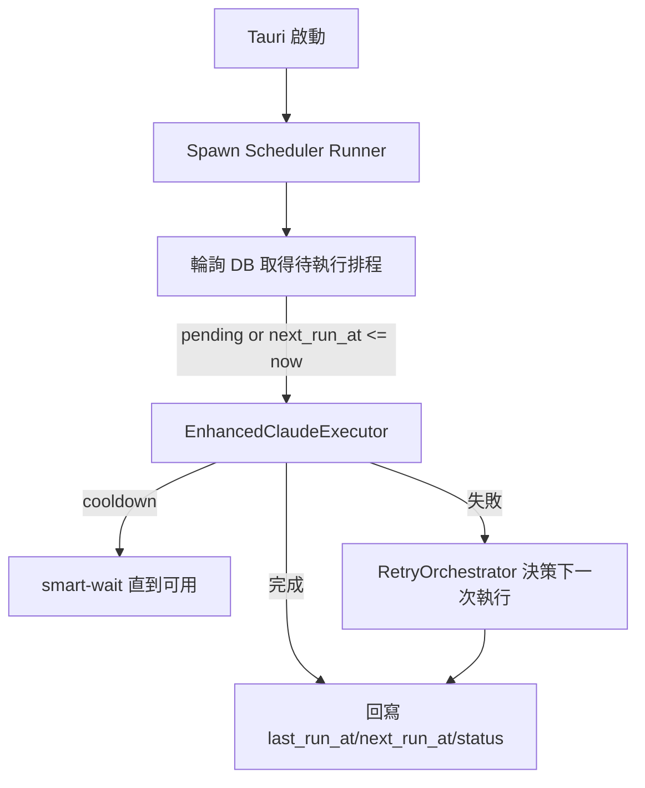

# 🧭 背景排程器（Scheduler Runner）設計規格

> 目標：在冷卻（cooldown）期間建立的任務，冷卻解除後能自動執行；支援錯過時間的補執行、重試與觀測性。與現有 `EnhancedClaudeExecutor` 智慧等待（smart-wait）能力整合。

## 🎯 範圍與非目標

- 範圍
  - 啟動型背景服務：Tauri 應用啟動時常駐於 tokio runtime
  - 排程來源：`schedules`（`SimpleSchedule`）與未來的 `jobs`（`JobRepository`）
  - 執行引擎：沿用 `EnhancedClaudeExecutor`（具冷卻檢測與 smart-wait）
  - 重試策略：沿用 `RetryOrchestrator`（SmartRetry/AdaptiveCooldown）
- 非目標
  - 大規模分散式佇列（僅單機）
  - 完整 UI 任務管理（後續迭代）

## 🧩 架構設計

### 啟動與生命週期

- 啟動：在 `lib.rs` 的 `setup` 階段 `spawn` 背景任務
- 關閉：應用退出時自動終止；不中斷進程的情況下每迴圈有可中止檢查

### 輪詢策略（Polling）

- 迴圈間隔：
  - 正常：15 秒
  - 冷卻接近（剩餘 ≤ 5 分鐘，由 `CooldownDetector`/`ccusage` 信號）：5 秒
  - 背景空轉 ≥ 5 分鐘：退避至 30 秒
- 每迴圈最多抓取 N 筆（預設 3）以控制併發；併發度由 `ExecutorConfig.max_concurrent_executions` 控制

### 單實例鎖（Single runner 保證）

- 使用 `tokio::sync::Mutex` + 單一任務 `spawn_once` 保證同一進程僅啟一個 Runner
- 未支援多進程鎖（單機假設）。若未來需要，可加入 DB level locking（`UPDATE ... WHERE ... AND owner IS NULL RETURNING`）

### 資料模型與相容性

- 既有 `schedules`（`SimpleSchedule`）欄位：`schedule_time`、`status`、`last_run_at`、`next_run_at`、`execution_count`
- 查詢條件：
  - `status IN ('pending','active')` AND `(next_run_at IS NULL OR next_run_at <= now)`
  - 或首次計畫：`schedule_time <= now AND status='pending'`
- 執行完成後：
  - 單次任務：`status='completed'`、`last_run_at=now`
  - 週期任務（含 cron）：計算 `next_run_at`、`last_run_at=now`、`execution_count+=1`

### 冷卻與重試

- 冷卻：由 `EnhancedClaudeExecutor` 內部處理 `pre_execution_cooldown_check()` + `smart_wait()`，Runner 不重複等待
- 重試：`RetryOrchestrator` 決定延遲；Runner 依回傳資訊更新 `next_run_at`

### 錯過（missed）補執行策略

- 啟動掃描：抓取 `next_run_at < now` 或 `schedule_time < now 且 status='pending'`
- 逐一補執行；若多筆，按 `created_at ASC`、`priority DESC`（未來 `jobs`）

### 設定與開關

- Tauri `tauri.conf.json` 或 `AppConfig`：
  - `scheduler.enabled`（預設 true）
  - `scheduler.poll_interval_seconds`（預設 15）
  - `scheduler.max_concurrent_jobs`（預設 3）

### 觀測性與日誌

- 重要事件：啟動、抓取數量、提交執行、結果、重試排程、錯誤堆疊
- 指標：`jobs_dispatched`、`jobs_succeeded`、`jobs_failed`、`cooldown_wait_seconds_total`

## ✅ 驗收標準（Acceptance Criteria）

- 功能：
  - 冷卻期間建立的排程，冷卻解除後自動執行（無需手動介入）
  - 錯過的待執行任務在啟動後被補執行
- 穩定性：連續 1 小時迴圈無 panic；執行失敗會重試並寫回 `next_run_at`
- 觀測性：日誌可追蹤每次取件與執行結果
- 測試：
  - 單元：Runner 計算取件條件與 `next_run_at` 更新
  - 整合：模擬冷卻中 → 解除，驗證自動執行（Playwright/E2E 視 UI 鉤子）

## 🧪 測試計畫（最小集）

- Rust 單元（new）：
  - `scheduler_runner::compute_pending_query()`
  - `scheduler_runner::update_next_run_at()`
- 整合（Playwright）：
  - 建立 3 分鐘內排程（測試模式 3 秒完成），在 Runner 開啟時自動顯示 `execution-complete`
  - 冷卻中建立排程 → 冷卻解除 → 自動完成

## 🔗 研究專案參考

- `research-projects/CCAutoRenew`：ccusage 時間區塊偵測與自適應檢查頻率（參考其 30s/120s/600s 間隔）
- `research-projects/Claude-Autopilot`：佇列與重試機制的服務化設計（借鏡 auto-retry 與 queue 處理）
- `research-projects/claude-code-schedule`：時間解析與倒數模型（Session/cron 類型）
- `research-projects/ClaudeNightsWatch`：守護行程/daemon 啟停與任務審計（可作為將來擴充）

## 🚀 實作路線

1. 在 `lib.rs` setup 中 `spawn` Runner 任務（受 `AppConfig.scheduler.enabled` 控制）
2. 建立 `scheduler_runner.rs`：查詢 → 派發 → 結果回寫
3. 串接 `EnhancedClaudeExecutor` 與 `RetryOrchestrator`
4. 新增最小單元測試與 2 條整合測試
5. 文檔與設定樣板更新

---

最後更新：2025-08-12 • 負責人：@s123104
