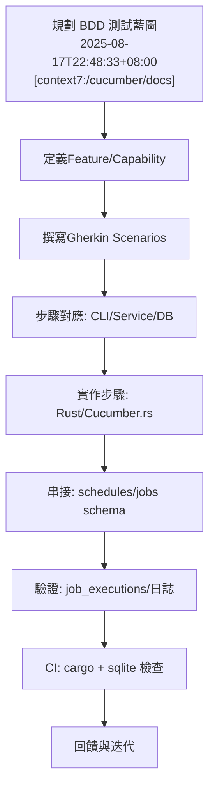

# Claude Night Pilot — 行為驅動開發（BDD）完整測試與重構計畫

時間: 2025-08-17T22:48:33+08:00 (Asia/Taipei)
來源: [context7:/cucumber/docs], [context7:/websites/rs_tokio], [context7:/tokio-rs/tracing]

---

## 1. 目的與範圍

- 目的：以 BDD 驅動目前排程系統（CLI/服務/資料庫）的驗收測試與重構，確保在不過度工程化的前提下達成高可維護性與低技術債。
- 範圍：
  - CLI：`prompt`、`job` 相關指令
  - 排程：`real_time_executor` 與相容層（`schedules` → `jobs` 過渡）
  - 資料庫：`prompts`、`schedules`、`jobs`、`job_executions` 一致性
  - 監控：執行結果與結構化日誌可觀測性

---

## 2. BDD 實施方式（建議工具與結構）

- 測試框架：Cucumber/Gherkin（Rust 以 cucumber-rs 或輕量解析器 + 驗證器實作步驟）
- 特色：Given/When/Then 可執行規格，對應 CLI/Service/DB 的步驟定義
- 專案結構（建議）：
  - `features/cli_job_management.feature`
  - `features/scheduler_execution.feature`
  - `features/database_consistency.feature`
  - `steps/cli_steps.rs`、`steps/db_steps.rs`、`steps/scheduler_steps.rs`
  - `support/world.rs`（共享測試狀態：資料庫連線、臨時目錄、時間函式）

---

## 3. Gherkin 規格（關鍵情境）

### 3.1 CLI 任務建立與列出（現況以 schedules 為準）

```gherkin
Feature: CLI job management via schedules
  As a CLI user
  I want to create and list scheduled jobs
  So that tasks are persisted and visible

  Background:
    Given the authoritative database is "claude-night-pilot.db"
    And schema includes tables "prompts", "schedules"

  Scenario: Create a job for an existing prompt
    Given a prompt exists with id 15 and title "企業級架構分析測試"
    When I run "cnp-unified job create 15 '*/5 * * * *' --description 'E2E BDD 測試'"
    Then the command should succeed
    And the schedules table should contain a new row with prompt_id 15 and cron_expr "*/5 * * * *"
    And "job list" should display at least 1 job
```

### 3.2 排程觸發與執行結果入庫（job_executions）

```gherkin
Feature: Scheduler execution with job_executions
  In order to observe execution results
  As a system owner
  I want each trigger to persist into job_executions

  Background:
    Given the real-time executor is able to start within a Tokio runtime

  Scenario: Execute a near-future job and persist result
    Given a prompt exists with id 15
    And a schedule exists for prompt 15 with a near-future cron expression
    When the scheduled time arrives
    Then execute_job_logic should be called once
    And a new job_executions row should be created with status either "Completed" or "Failed"
    And logs should contain a structured span for execution start and end
```

### 3.3 資料庫一致性與過渡（schedules → jobs）

```gherkin
Feature: Database consistency and migration plan
  To reduce technical debt
  We need a phased migration from schedules to jobs/job_executions

  Scenario: Phase 2 write redirect
    Given the migration flag is enabled (design-time)
    When a new job is created via CLI
    Then data should be written to jobs table
    And schedules becomes read-only for that codepath

  Scenario: Backfill existing schedules to jobs
    Given existing schedules rows
    When I run the migration script
    Then equivalent rows should be inserted to jobs with mapped fields
    And counts between schedules and jobs should match on a sample basis
```

---

## 4. 步驟定義建議（Rust 端對應）

- DB 步驟：
  - 連線 `claude-night-pilot.db`，查詢/斷言表內容。
  - 以 `spawn_blocking` 進行阻塞 I/O（Tokio 最佳實踐）。
- CLI 步驟：
  - 透過 `std::process::Command` 執行 `cargo run --bin cnp-unified -- ...`，擷取 stdout/stderr 與退出碼。
- Scheduler 步驟：
  - 啟動 `RealTimeExecutor::start()` 於可控 runtime；必要時以保底 `tokio::time::interval` stub 驗證觸發（短期降級策略）。
- 日誌步驟：
  - 以 tracing subscriber 設為 JSON/compact，搜尋 execution start/end 的 span/event。

---

## 5. 分階段落實路線（對應 BDD）

- Phase 1（當前）

  - 以 `schedules` 作為主線驗收：CLI 建立/列出 → 近時執行 → 落庫 `job_executions`（引擎已就緒）。
  - 建立 features 與步驟，先在 CI 中 dry-run 檢測（不要求定時實觸發）。

- Phase 2（過渡）

  - 將「新寫入」導向 `jobs`，提供資料庫遷移腳本與回歸測試。
  - `schedules` 作為唯讀相容層；更新 BDD 場景以覆蓋新路徑。

- Phase 3（去重）
  - 移除 `simple_job_manager` 與舊排程器，統一至 `real_time_executor`。
  - 將 trait 中 `async fn` 改為 `fn -> impl Future`（避免 lint 警告）。

---

## 6. 失敗模式與觀測點（Given/When/Then 延伸）

- 註冊告警（cron job 無法註冊）
  - Then：依降級策略以 interval 觸發（stub）驗證 `execute_job_logic` 仍可被呼叫。
- 空內容或 prompt 缺失
  - Then：`JobExecutionResult.status = Failed` 且 `error_message` 記錄具體原因。
- DB 路徑不一致
  - Then：BDD 步驟直接斷言 `DEFAULT_DATABASE_PATH` 與實際連線路徑一致（僅驗收，程式碼修正分階段執行）。

---

## 7. 執行方式（不更動程式碼前提）

- 以 docs 驅動：先撰寫 `.feature` 與規格對應；步驟可先以 shell 驗證（CI 腳本執行 CLI + sqlite3 斷言）。
- 導入 Rust BDD（cucumber-rs）作為後續加值（非本階段硬需求）。

---

## 8. 成功標準（Acceptance）

- Phase 1：`schedules` 驗收 100% 綠燈；`job_executions` 能產生至少 1 條成功（或失敗）記錄；CLI 功能全數可用。
- Phase 2：新寫入切至 `jobs` 後，BDD 場景仍全部綠燈；遷移對帳通過。
- Phase 3：去重後，無 deprecated 警告，所有 BDD 場景綠燈。

---

## 9. 附件（流程圖）



---

（完）
