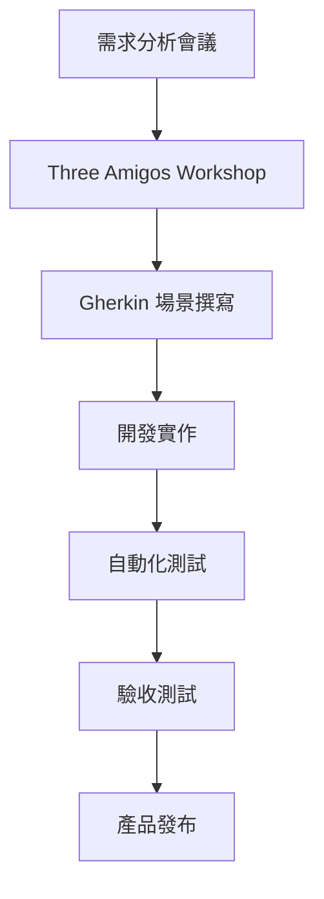

# Claude Night Pilot BDD 測試實施指南

## 概述

本指南基於使用者提供的 BDD 最佳實踐框架，為 Claude Night Pilot 專案提供完整的 BDD 測試實施方案。

## 📋 目錄

1. [組織架構](#組織架構)
2. [開發流程](#開發流程)
3. [Gherkin 撰寫規範](#gherkin-撰寫規範)
4. [測試策略](#測試策略)
5. [自動化實施](#自動化實施)
6. [CI/CD 整合](#cicd-整合)
7. [品質檢核清單](#品質檢核清單)
8. [工具配置](#工具配置)
9. [範本與範例](#範本與範例)

## 組織架構

### Three Amigos 協作模式

**角色定義**：
- **產品負責人 (PO)**：定義業務需求和驗收標準
- **開發人員 (Dev)**：技術實作和可行性評估
- **測試人員 (QA)**：測試策略和品質保證

**協作流程**：


### 專案結構

```
tests/
├── bdd-specifications/           # BDD 規範文件
│   ├── gui-functionality.feature
│   ├── material-design-color-system.feature
│   ├── responsive-design.feature
│   ├── core-functionality-e2e.feature
│   └── accessibility.feature
├── step-definitions/             # 步驟定義實作
│   ├── gui-steps.js
│   ├── theme-steps.js
│   ├── responsive-steps.js
│   └── e2e-steps.js
├── support/                      # 測試支援檔案
│   ├── hooks.js
│   ├── world.js
│   └── helpers/
├── fixtures/                     # 測試資料
├── reports/                      # 測試報告
└── config/                       # 測試配置
    ├── cucumber.js
    └── environments/
```

## 開發流程

### 1. 需求分析階段

**活動**：
- 使用者故事分析
- 驗收標準定義
- 風險評估

**產出**：
- 使用者故事卡
- 驗收標準清單
- 風險矩陣

### 2. Three Amigos Workshop

**準備工作**：
- 準備使用者故事
- 收集相關文檔
- 安排會議時間 (建議 90 分鐘)

**會議議程**：
```
0-15 分鐘：使用者故事回顧
15-45 分鐘：場景發想和討論
45-75 分鐘：Gherkin 場景撰寫
75-90 分鐘：驗收標準確認
```

### 3. Gherkin 場景撰寫

**撰寫原則**：
- 使用業務語言，避免技術術語
- 專注於使用者行為和期望結果
- 保持場景獨立性
- 使用具體的範例資料

### 4. 開發實作

**TDD 流程**：
```
Red → Green → Refactor
失敗 → 通過 → 重構
```

**步驟定義實作**：
- 先寫失敗的步驟定義
- 實作最小可行代碼
- 重構改善代碼品質

## Gherkin 撰寫規範

### 基本結構

```gherkin
# 功能描述
功能: [功能名稱]
  作為 [角色]
  我希望 [功能]
  以便 [價值]

  # 共同前置條件
  背景:
    假設 [前置條件]
    並且 [額外條件]

  # 測試場景
  @標籤
  場景: [場景描述]
    假設 [前置條件]
    當 [操作步驟]
    那麼 [預期結果]
    並且 [額外驗證]
```

### 中文撰寫標準

**關鍵字映射**：
```
Feature → 功能
Background → 背景
Scenario → 場景
Scenario Outline → 場景大綱
Given → 假設
When → 當
Then → 那麼
And → 並且
But → 但是
Examples → 例子
```

### 標籤系統

**功能標籤**：
- `@gui` - 圖形介面測試
- `@api` - API 測試
- `@integration` - 整合測試
- `@e2e` - 端到端測試

**優先級標籤**：
- `@critical` - 關鍵功能
- `@major` - 主要功能
- `@minor` - 次要功能

**技術標籤**：
- `@material-design` - Material Design 相關
- `@responsive` - 響應式設計
- `@accessibility` - 無障礙設計
- `@performance` - 效能測試

## 測試策略

### 測試金字塔

```
    E2E 測試 (10%)
    ↗ 整合測試 (30%)
      ↗ 單元測試 (60%)
```

### Component BDD (60%)

**範圍**：個別組件行為驗證
**工具**：Jest + React Testing Library + Cucumber
**特色**：快速執行，隔離測試

**範例**：
```gherkin
場景: 主題切換按鈕行為
  假設 當前主題為 "light"
  當 我點擊主題切換按鈕
  那麼 主題應該切換為 "dark"
  並且 按鈕圖標應該更新
```

### Integration BDD (30%)

**範圍**：模組間整合測試
**工具**：Jest + MSW + Cucumber
**特色**：API 模擬，資料流驗證

**範例**：
```gherkin
場景: Prompt 資料載入整合
  假設 後端 API 正常運作
  當 前端請求 Prompt 列表
  那麼 應該收到正確格式的資料
  並且 UI 應該正確顯示 Prompt
```

### E2E BDD (10%)

**範圍**：完整使用者流程
**工具**：Playwright + Cucumber
**特色**：真實瀏覽器環境，完整流程驗證

**範例**：
```gherkin
場景: 完整 Prompt 工作流程
  假設 我登入應用程式
  當 我創建並執行新的 Prompt
  那麼 我應該在結果頁面看到執行結果
```

## 自動化實施

### Playwright + Cucumber 設定

**安裝依賴**：
```bash
npm install --save-dev @cucumber/cucumber @cucumber/html-reporter
npm install --save-dev playwright @playwright/test
```

**Cucumber 配置** (`cucumber.js`)：
```javascript
module.exports = {
  default: {
    require: ['tests/step-definitions/**/*.js'],
    format: [
      'progress',
      'json:reports/cucumber-report.json',
      'html:reports/cucumber-report.html'
    ],
    paths: ['tests/bdd-specifications/**/*.feature'],
    parallel: 2,
    retry: 1,
    timeout: 60000,
    worldParameters: {
      browserConfig: {
        headless: process.env.CI === 'true',
        viewport: { width: 1280, height: 720 }
      }
    }
  }
};
```

### Step Definitions 結構

**World 設定** (`tests/support/world.js`)：
```javascript
const { setWorldConstructor, Before, After } = require('@cucumber/cucumber');
const { chromium } = require('playwright');

class CustomWorld {
  constructor() {
    this.browser = null;
    this.context = null;
    this.page = null;
  }

  async openBrowser() {
    this.browser = await chromium.launch({
      headless: process.env.CI === 'true'
    });
    this.context = await this.browser.newContext();
    this.page = await this.context.newPage();
  }

  async closeBrowser() {
    if (this.browser) {
      await this.browser.close();
    }
  }
}

setWorldConstructor(CustomWorld);

Before(async function() {
  await this.openBrowser();
});

After(async function() {
  await this.closeBrowser();
});
```

**步驟定義範例** (`tests/step-definitions/gui-steps.js`)：
```javascript
const { Given, When, Then } = require('@cucumber/cucumber');
const { expect } = require('@playwright/test');

Given('Claude Night Pilot 應用程式已啟動', async function() {
  await this.page.goto('http://localhost:8080');
  await this.page.waitForLoadState('networkidle');
});

When('我點擊 {string} 導航按鈕', async function(navItem) {
  const navSelector = `[data-testid="nav-${navItem.toLowerCase()}"]`;
  await this.page.click(navSelector);
});

Then('我應該看到 {string} 頁面', async function(pageTitle) {
  const titleElement = this.page.locator('h2').first();
  await expect(titleElement).toContainText(pageTitle);
});
```

## CI/CD 整合

### GitHub Actions 工作流程

**測試工作流程** (`.github/workflows/bdd-tests.yml`)：
```yaml
name: BDD Tests

on:
  push:
    branches: [ main, develop ]
  pull_request:
    branches: [ main ]

jobs:
  bdd-tests:
    runs-on: ubuntu-latest
    
    steps:
    - uses: actions/checkout@v3
    
    - name: Setup Node.js
      uses: actions/setup-node@v3
      with:
        node-version: '18'
        cache: 'npm'
    
    - name: Install dependencies
      run: |
        npm ci
        npx playwright install chromium
    
    - name: Start application
      run: |
        npm run dev &
        sleep 30
    
    - name: Run BDD tests
      run: |
        npm run test:bdd
      env:
        CI: true
    
    - name: Upload test reports
      uses: actions/upload-artifact@v3
      if: always()
      with:
        name: bdd-test-reports
        path: tests/reports/
```

### 測試報告生成

**HTML 報告配置**：
```javascript
// tests/config/report-config.js
const reporter = require('@cucumber/html-reporter');

const options = {
  theme: 'bootstrap',
  jsonFile: 'reports/cucumber-report.json',
  output: 'reports/cucumber-report.html',
  reportSuiteAsScenarios: true,
  scenarioTimestamp: true,
  launchReport: false,
  metadata: {
    "應用程式版本": "0.2.0",
    "測試環境": "Development",
    "瀏覽器": "Chromium",
    "平台": process.platform,
    "並行執行": "是"
  }
};

reporter.generate(options);
```

## 品質檢核清單

### Gherkin 品質檢查

**語言品質**：
- [ ] 使用業務語言，避免技術實作細節
- [ ] 場景描述清晰，符合 Given-When-Then 結構
- [ ] 步驟具體且可驗證
- [ ] 避免過於複雜的場景

**結構品質**：
- [ ] 合適的標籤分類
- [ ] 場景獨立性（不依賴其他場景）
- [ ] 適當的資料表格使用
- [ ] 場景大綱有效運用

**維護性**：
- [ ] 步驟可重用性高
- [ ] 測試資料管理良好
- [ ] 文件結構清晰

### 測試實作品質

**程式碼品質**：
- [ ] 步驟定義實作完整
- [ ] 錯誤處理適當
- [ ] 測試資料隔離
- [ ] 清理機制完善

**執行效率**：
- [ ] 測試執行時間合理
- [ ] 並行執行支援
- [ ] 資源使用最佳化
- [ ] 失敗快速回饋

### 報告品質

**內容完整性**：
- [ ] 測試結果清晰呈現
- [ ] 失敗原因明確
- [ ] 執行統計資料完整
- [ ] 歷史趨勢分析

**可讀性**：
- [ ] 報告格式美觀
- [ ] 資訊分類清楚
- [ ] 搜尋功能便利
- [ ] 行動裝置友善

## 工具配置

### package.json 腳本

```json
{
  "scripts": {
    "test:bdd": "cucumber-js",
    "test:bdd:debug": "cucumber-js --fail-fast",
    "test:bdd:tags": "cucumber-js --tags",
    "test:bdd:parallel": "cucumber-js --parallel 4",
    "test:bdd:report": "node tests/config/report-config.js",
    "test:component-bdd": "jest --config tests/config/jest-bdd.config.js",
    "test:all": "npm run test:component-bdd && npm run test:bdd"
  }
}
```

### VSCode 設定

**推薦擴充功能**：
- Cucumber (Gherkin) Full Support
- Playwright Test for VSCode
- GitLens
- Better Comments

**設定檔** (`.vscode/settings.json`)：
```json
{
  "cucumber.features": ["tests/bdd-specifications/**/*.feature"],
  "cucumber.glue": ["tests/step-definitions/**/*.js"],
  "files.associations": {
    "*.feature": "gherkin"
  },
  "editor.quickSuggestions": {
    "strings": true
  },
  "playwright.reuseBrowser": true
}
```

## 範本與範例

### 新功能 BDD 範本

```gherkin
# [功能名稱] BDD 規範
# 簡短描述功能目的和範圍

@[主要標籤] @[次要標籤]
功能: [功能名稱]
  作為 [使用者角色]
  我希望 [期望功能]
  以便 [獲得價值]

  背景:
    假設 [共同前置條件]
    並且 [環境設定]

  @[場景標籤]
  場景: [主要成功路徑]
    假設 [特定前置條件]
    當 [使用者操作]
    那麼 [期望結果]
    並且 [額外驗證]

  @[錯誤標籤]
  場景: [錯誤處理]
    假設 [錯誤前置條件]
    當 [觸發錯誤的操作]
    那麼 [錯誤處理結果]
    並且 [使用者回饋]

  @[邊界標籤]
  場景大綱: [邊界條件測試]
    假設 [基礎條件]
    當 我輸入 "<輸入值>"
    那麼 結果應該是 "<預期結果>"

    例子:
      | 輸入值     | 預期結果   |
      | [範例1]    | [結果1]    |
      | [範例2]    | [結果2]    |
```

### 步驟定義範本

```javascript
const { Given, When, Then } = require('@cucumber/cucumber');
const { expect } = require('@playwright/test');

// 前置條件步驟
Given('我在 {string} 頁面', async function(pageName) {
  await this.page.goto(`/${pageName}`);
  await this.page.waitForLoadState('networkidle');
});

// 操作步驟
When('我點擊 {string} 按鈕', async function(buttonText) {
  await this.page.click(`button:has-text("${buttonText}")`);
});

// 驗證步驟
Then('我應該看到 {string} 訊息', async function(message) {
  const messageElement = this.page.locator('.notification');
  await expect(messageElement).toContainText(message);
});

// 資料表格步驟
Then('表單應該包含以下欄位:', async function(dataTable) {
  const fields = dataTable.hashes();
  for (const field of fields) {
    const input = this.page.locator(`input[name="${field.name}"]`);
    await expect(input).toBeVisible();
    if (field.required === '是') {
      await expect(input).toHaveAttribute('required');
    }
  }
});
```

## 最佳實踐建議

### Gherkin 撰寫

1. **使用業務語言**：避免技術術語，專注於使用者價值
2. **保持簡潔**：每個場景專注於單一行為
3. **資料驅動**：使用場景大綱處理多種輸入
4. **獨立性**：場景間不應有依賴關係

### 測試實作

1. **頁面物件模式**：封裝頁面元素和行為
2. **等待策略**：使用明確等待，避免固定延遲
3. **資料管理**：使用測試夾具和建構器模式
4. **清理策略**：確保測試後環境清理

### 維護策略

1. **定期檢視**：定期檢查和更新測試場景
2. **版本控制**：追蹤測試變更和原因
3. **文檔同步**：保持規範與實作同步
4. **培訓計畫**：確保團隊成員熟悉 BDD 實踐

這個實施指南為 Claude Night Pilot 提供了完整的 BDD 測試框架，確保從需求分析到自動化測試的完整覆蓋。